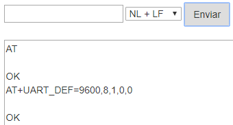

# Modulo ESP8266 ESP 01, shield de programación y dirección MAC

## Módulo ESP8266 ESP 01

### Introducción
El módulo Wifi seleccionado (ESP-01) es uno de las más populares y económicos, pese a no ser el más potente ni versátil. Actualmente, otros modelos como la ESP-12 se están integrando en la mayoría de placas de desarrollo, cobrando un peso e importancia mucho mayor. Sin embargo, nosotros vamos a asociar nuestro pequeño ESP-01 a un Arduino UNO, con el único fin de darle conectividad Wifi. Es este motivo por el que se ha considerado este modelo concreto el idóneo para llevar a cabo el proyecto aquí expuesto, ya que no necesitamos más pines extra, ni otro tipo de ventajas que incluyen modelos superiores.

El ESP-01 trae instalado una versión de firmware con la que podemos comunicarnos con el ESP8266 mediante comandos AT (los veremos a continuación) a través del puerto serie. Este tipo de comunicación nos va a permitir crear un puente entre la placa de control del proyecto y el ESP8266, consiguiendo así conectar a una red WIFI y dar un primer paso de gigantes en el mundo IoT.

### Características
El aspecto del ESP-01 y algunas de sus características los vemos a continuación.

|Aspecto del ESP-01|
|:|
| |

ESP8266 es el microcontrolador del módulo ESP-01. La memoria flash es la BG25Q80A. Los LEDs informan de si está encendido o no y de la transmisión de datos (Tx y Rx). La antena WiFi para la conexión a internet está diseñada en la placa. Los pines permiten conectar alimentación, sensores, … Toda la información en el [datasheet](https://www.microchip.ua/wireless/esp01.pdf) del fabricante.

A continuación vemos la imagen con la distribución de pines y su significado:

|Distribución de pines en el ESP-01|
|:|
| |

* 1 - GND
* 2 - Pin digital número 2
* 3 - Pin digital número 0
* 4 - RXD es el pin por donde se van a recibir los datos del puerto serie. Trabaja a 3,3 V. También puede ser el pin digital GPIO3
* 5 - TXD es el pin por donde se van a transmitir los datos del puerto serie. Trabaja a 3,3 V. También puede ser el pin digital GPIO1
* 6 - CH_PD es el pin para apagar y encender el ESP-01: si lo ponemos a 0 V (LOW) se apaga, y a 3,3 V (HIGH) se enciende.
* 7 - RESET pin a 0V resetea el ESP-01
* Vcc es el pin de alimentación. Funciona a 3,3V y admite un máximo de 3,6 V. La corriente suministrada debe ser mayor que 200 mA.

Datos obtenidos de [programarfacil](https://programarfacil.com/).

*GPIO (del inglés, General Purpose Input Output) son entradas o salidas de propósito general, o sea pines digitales.

El ESP-01 soporta comunicación I2C, por lo que, pese a tener solo un par de GPIOs, podemos conectarle multitud de sensores y actuadores a través del mencionado bus de datos I2C.*

## Programación del módulo ESP8266 ESP 01
El ESP-01 dispone de un microcontrolador y una memoria donde poder almacenar programas, luego es un dispositivo programable en si mismo. Cargar programas en el dispositivo es algo mas complejo de lo que normalmente estamos acostumbrados dado que tiene dos modos de operación, el modo flash o de ejecución y el modo UART o de grabación y debemos ser nosotros quienes activemos un modo u otro, cosa que, por ejemplo, en el entorno ArduinoBlocks el mismo ha sido el encargado de hacerlo. Los modos de operación se configuran a través de los puertos GPIO0 y GPIO2.

Para programar el ESP-01 hay que usar los pines Rx y Tx para transmitir los datos a la memoria Flash, donde se almacenará el sketch o programa.

En las placas de control los pines Rx y Tx están en los pines D0 y D1 respectivamente y también son los que se utilizan para cargar programas a una velocidad de 115200 baudios, así que si estos pines los ocupamos con el ESP8266 no podremos cargar programas en nuestra placa. Ahora bien, es posible utilizar otros pines para usar WiFi y evitar este problema, pero el resto de pines digitales solamente trabajan a 9600 baudios y el ESP-01 por defecto viene a 115200, luego para utilizarlo en pines distintos a los D0 y D1 de la placa tendremos que reprogramarlo para que la velocidad sea de 9600 baudios.

* **Modo de funcionamiento UART**. Para cargar un programa en el ESP-01 debemos o bien encenderlo o bien resetearlo pero teniendo los siguientes estados de pines:

- GPIO0 = 0 (nivel bajo o LOW = 0 V)
- GPIO2 = 1 (nivel alto o HIGH = 3,3 V = Vcc).

Recordemos siempre que el ESP8266 trabaja con niveles lógicos de 3,3 V.

El pin GPIO2 está por defecto a HIGH, ya que tiene un pull-up interno, por lo que podemos dejarlo simplemente desconectado.

* **Modo de funcionamiento Flash**. Para ejecutar un programa en el ESP-01 una vez cargado debemos tener la siguiente configuración de pines:

- GPIO0 = 1
- GPIO2 = 1

Tanto el GPIO0 como el GPIO2 están por defecto a HIGH, ya que ambos tienen un pull-up interno, por lo que podemos dejarlos simplemente desconectados.

En este momento reflexionamos sobre el uso de Rx y Tx ya que si los estamos utilizando para cargar el programa en la placa y GPIO0 y GPIO2 para indicar el modo de trabajo ¿cómo conectamos los sensores y actuadores al ESP-01?. Veamos:

1. Rx y Tx los utilizamos para cargar el programa. Una vez finalizada la carga los podemos utilizar como pines de entrada y salida digitales.
2. Los modos de trabajo se indican cuando se resetea o reinicia la placa. Una vez que tengamos el modo de ejecución podemos conectar cualquier componente a estos pines.

Los programas los podemos subir a nuestro ESP-01 mediante el IDE de Arduino, que no vamos a explicar aquí, o por medio de un convertidor USB-serie igual o similar al [KS0388 Keyestudio USB to ESP-01S Wifi Module Serial Port Shield](https://wiki.keyestudio.com/KS0388_Keyestudio_USB_to_ESP-01S_Wifi_Module_Serial_Port_Shield) de la imagen.

|Shield para el módulo WiFi ESP-01|
|:|
| |

Se trata de un escudo o shield para el módulo WiFi ESP-01 que está provisto de un chip conversor de USB a puerto serie, en concreto el CH340G.

El proceso de reprogramación con esta placa es bastante sencillo pero requiere de comando AT que pasamos a introducir antes de continuar.

### Comando AT en el ESP8266
El ESP-01 viene por defecto con el firmware AT ai-thinker V0.9.2.4.

Los módems venían con un conjunto de comandos que permiten que nos podamos comunicar con ellos para configurarlos y que lo podamos hacer a través del puerto serie de ordenador al que están conectados. A estos comandos se les llama AT (de attention).

Después de cada comando AT, el ESP8266 espera los caracteres especiales de nueva linea para ejecutar el comando. El carácter no imprimible CR (del inglés, Carriage Return) significa retorno de carro y LF ( del inglés, Line Feed) es salto de línea. El origen de la nomenclatura está en las máquinas de escribir.

En el enlace tenemos un pdf de la empresa [Espressif Systems](https://docs.google.com/viewer?url=https%3A%2F%2Fwww.espressif.com%2Fsites%2Fdefault%2Ffiles%2Fdocumentation%2F4a-esp8266_at_instruction_set_en.pdf) con el juego de comandos AT para el ESP8266.

### Preparación del módulo ESP-01
Primero conectamos el módulo ESP8266 a la shield USB-serie y este a su vez a un puerto USB de nuestro ordenador. Nos aseguramos de que el interruptor está en modo Flash Boot.

Entramos en ArduinoBlocks con ArduinoBlocks-Connector en funcionamiento, realizamos un refresco de la lectura del puerto para que detecte a la shield del módulo Wi-fi si es necesario, abrimos la consola, escogeremos la opción de 115200 en baudrate y también la de NL + LF (NL + LF es igual que CR + LF) para comunicarnos con el módulo Wi-fi.

Hacemos clic en Conectar y conectamos la consola, escribimos “AT” en ella y clic en enviar. La situación es la de la imagen siguiente:

|Conexión y configuración de la consola|
|:|
| |

Si todo es correcto debe respondernos “OK”. Si responde algo sin sentido o no contesta, significa que está configurado en alguna otra velocidad. En este segundo caso deberemos cambiar la opción de baudrate y repetir la operación con diferentes velocidades hasta que nos responda “OK”. La situación correcta en la consola de comandos es la siguiente:

|Conexión correcta|
|:|
| |

Una vez que nos responda “OK”, le enviamos el texto “AT+UART_DEF=9600,8,1,0,0” y nos debe responder otra vez “OK”.

|Cambio del baudrate a 9600|
|:|
| |

Con esto hemos cambiado la velocidad a 9600 baudios mediante el comando AT+UART_DEF que nos permite cambiar la definición a 9600 baudios, con 8 bits de datos, 1 bit de parada, sin paridad y sin habilitar el control de flujo.

## Obtener la dirección MAC del ESP-01

### Introducción
Pretendemos averiguar la dirección fisica o MAC de un dispositivo de conexión WiFi y para ello vamos a seguir unos sencillo pasos, uqe si los ejecutamos en el orden correcto nos darán el resultado esperado.

Yo lo voy a hacer sobre una placa Keyestudio UNO, pero el procedimiento puede ser válido para otros modelos de placa.

### Firmware
Antes de conectar nada a nuestra placa vamos a cargar un programa vacío en el IDE de arduino y grabarlo en la placa Keyestudio UNO.

***
~~~
void setup() {
  // put your setup code here, to run once:
}
void loop() {
  // put your main code here, to run repeatedly:
}
~~~
***

### Conexionado
Ahora procedemos a conectar nuestro ESP8266 ESP01 para poder comunicar nuestro ordenador con el ESP8266. El esquema es el que vemos en la imagen siguiente:

|Conexionado ESP-01 y UNO|
|:|
| |

### Comunicación entre PC y ESP01
Con un programa vacío en nuestra placa Keyestudio UNO y las conexiones descritas en realidad lo que hacemos es usar la placa UNO como un convertidor bidireccional USB a RS232 que nos permite comunicar el ordenador con la placa ESP8266 ESP01. Abrimos el monitor serie desde el IDE de Arduino y lo configuramos como vemos en la imagen siguiente:

|Configuración inicial|
|:|
| |

Escribimos AT y pulsamos Enter o clicamos en Enviar y el módulo deberá responder OK si todo es correcto. Si la velocidad por defecto del módulo no es de 115200 no responerá y posiblemente se vean caracteres extraños en el monitor serie. En este caso habrá que probar distintas velocidades hasta conseguir que el módulo responda OK al comando AT. El resultado correcto lo vemos en la imagen siguiente:

|Conexión correcta|
|:|
| |

### Dirección MAC
El último paso es teclear el comando AT para conseguir la dirección física o MAC del dispositivo conectado. Este comando es el que vemos en la imagen siguiente:

|Comando para obtener la MAC|
|:|
| |

El comando AT+CIFSR nos devuelve el siguiente resultado:

|Respuesta al comando comando AT+CIFSR|
|:|
| |

