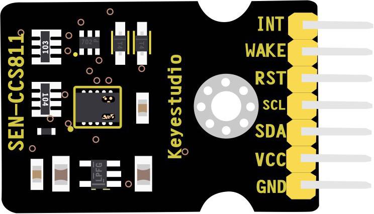
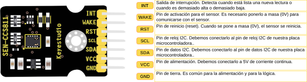
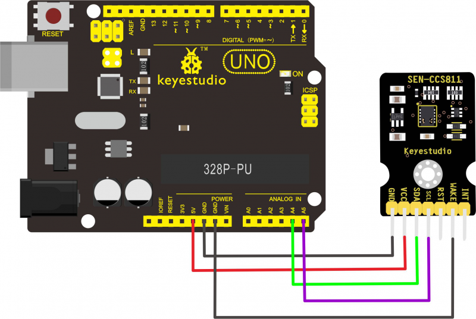
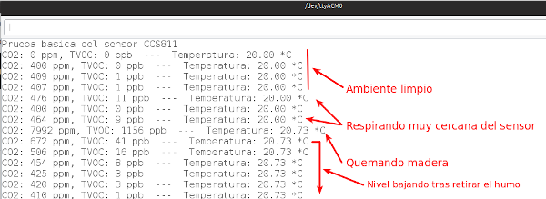

# Sensor CCS811 de eCO2, TVOC y temperatura

## Descripción
El sensor mide parámetros de calidad del aire y utiliza el chip CCS811B. Es un pequeño sensor de gas digital de muy bajo consumo que puede detectar una amplia gama de compuestos orgánicos volátiles, incluidos los niveles equivalentes de dióxido de carbono (eCO2) y óxido metálico (MOX).

La respuesta del sensor al dióxido de carbono equivalente (eCO2) se mide en el rango de 400 a 8192 ppm, y otros compuestos orgánicos volátiles (TVOC, del inglés Volatile Organic Compound) varían de 0 a 1187 ppb.

El sensor también cuenta con un termistor de precisión de 10K 1% tipo NTC, que se puede utilizar para medir la temperatura.

Si queremos aprender mas sobre los VOC podemos hacerlo en el enlace [Compuestos orgánicos volátiles](https://es.wikipedia.org/wiki/Compuestos_org%C3%A1nicos_vol%C3%A1tiles) pero al menos debemos saber que son liberados al quemar combustibles como gasolina, madera, carbón o gas natural y que también son liberados por disolventes, pinturas y otros productos empleados y almacenados en la casa y el lugar de trabajo.

Algunos ejemplos de compuestos orgánicos volátiles son:

* Naturales: isopreno, pineno y limoneno
* Artificiales: benceno, tolueno, nitrobenceno
* Otros ejemplos: formaldehído, clorobenceno, disolventes como tolueno, xileno, acetona y tetracloroetileno.

En la wiki del enlace tenemos toda la información original del sensor [KS0457 CCS811 de keyestudio](https://wiki.keyestudio.com/KS0457_keyestudio_CCS811_Carbon_Dioxide_Air_Quality_Sensor) que tiene el aspecto de la imagen siguiente:

|Aspecto del sensor CCS811|
|:|
|

## Especificaciones

* Tensión de alimentación: 5V DC
* Consumo: 30mA
* Potencia máxima: 46mW
* Rango de medida eCO2: 400-8192 ppm
* Rango de medida TVOC: 0 to 1187 ppb
* Temperatura de trabajo: -25 ~ +65℃

## Distribución de patillas
En la imagen siguiente vemos el pinout del dispositivo.

|Pinout del sensor CCS811|
|:|
|

## Conexionado

El conexionado básico del sensor lo vemos en la imagen siguiente que ha sido extraida de su wiki.

|Conexionado del sensor CCS811|
|:|
|

## Prueba del sensor CCS811

### Librería
Para poder trabajar con este sensor necesitamos descargarnos e instalar la librería [Adafruit CCS811](https://github.com/adafruit/Adafruit_CCS811) que está disponible en el enlace.

Si necesitas saber mas sobre librerías en Arduino u otras muchas cosas te recomiendo visitar la web de Luis del Valle [Programarfacil](https://programarfacil.com/) y en concreto la entrada del blog [Cómo instalar una librería de Arduino en el entorno de desarrollo](https://programarfacil.com/blog/arduino-blog/instalar-una-libreria-de-arduino/) para aprender todo sobre las librerías.

La propia librería incluye dos ejemplos de uso y en base a ellos vamos a desarrollar el código para la prueba del sensor.

### Prueba inicial
Vamos a tomar lectura de los datos del sensor y mostrar los resultados por el puerto serie. El código del programa ([descargar](Programas/CCS811/Prueba-inicial/Prueba-inicial.ino)) es el siguiente:

***

~~~
#include "Adafruit_CCS811.h"
Adafruit_CCS811 ccs;

void setup() {
  Serial.begin(9600);
  Serial.println("Prueba basica del sensor CCS811");
  
  if(!ccs.begin()){
    Serial.println("¡Error iniciando el sensor! Por favor revisar conexionado.");
    while(1);
  }
  //calibración del sensor de temperatura
  while(!ccs.available());
  float temperatura = ccs.calculateTemperature();
  ccs.setTempOffset(temperatura - 20.0); //ajuste temperatura
}

void loop() {
  if(ccs.available()){
    float temperatura = ccs.calculateTemperature();
    if(!ccs.readData()){ //si no está tomando lectura enviar datos
      Serial.print("CO2: ");
      Serial.print(ccs.geteCO2());
      Serial.print(" ppm, TVOC: ");
      Serial.print(ccs.getTVOC());
      Serial.print(" ppb  ---  Temperatura: ");
      Serial.print(temperatura);
      Serial.println(" *C");
    }
    else{
      Serial.println("¡ ERROR !");
      while(1);
    }
  }
  delay(5000);
}
~~~

***

En la imagen siguiente podemos ver los resultados comentados.

|Resultados de la prueba inicial del sensor CCS811|
|:|
|

En la web [Semáforo óptico-acústico de CO2 y nivel de ruido](https://clubroboticagranada.github.io/semaforo-optico-acustico-CO2/) puedes aprender mucho mas acerca de este sensor y en general sobre conceptos de CO2 y VOC.
