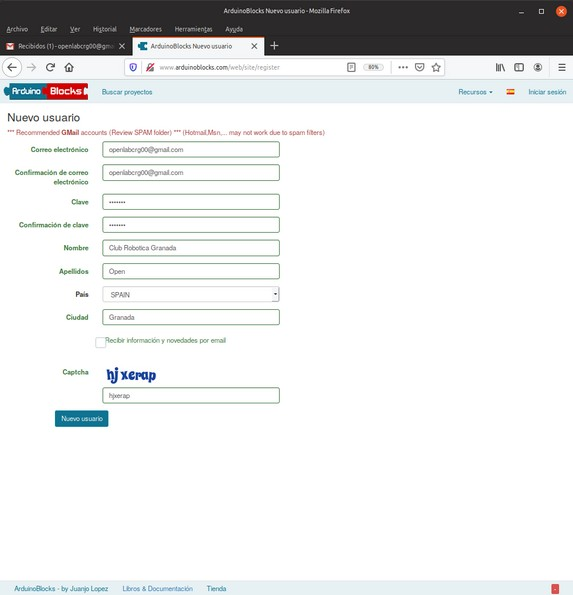
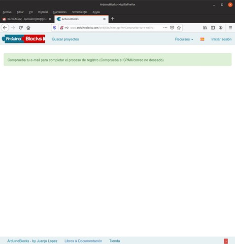
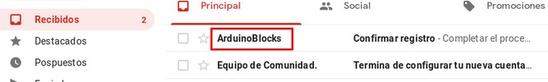
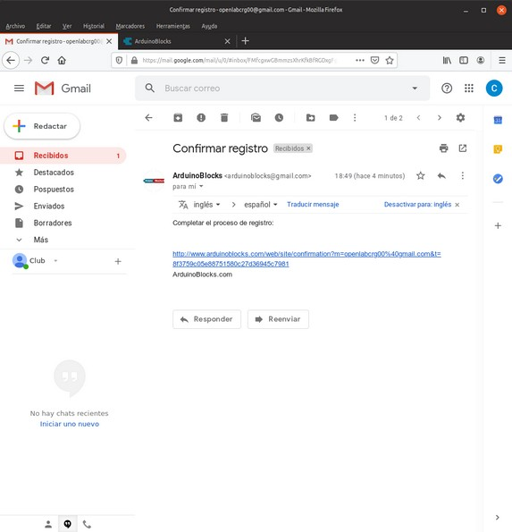
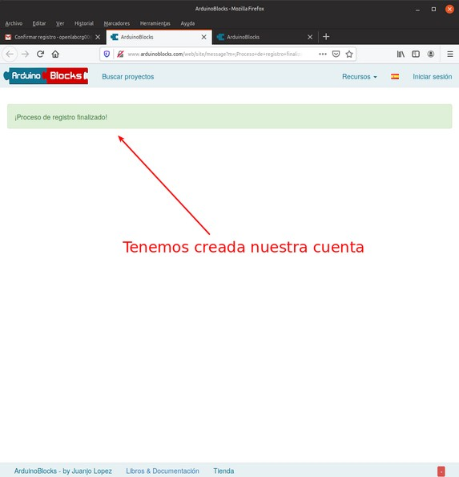
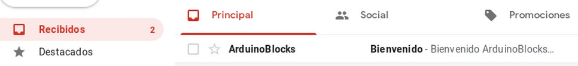
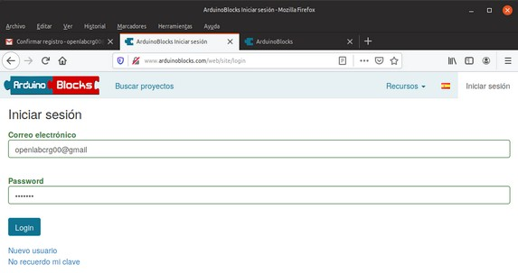
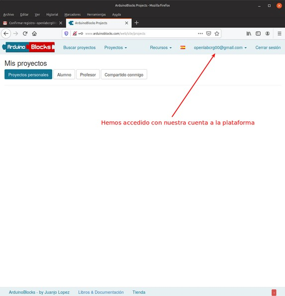

# Crear una cuenta en ArduinoBlocks

* ArduinoBlocks es una plataforma online de JUAN JOSÉ LÓPEZ ALMENDROS.
* ArduinoBlocks es una plataforma web online donde podemos programar nuestra placa Arduino de forma visual.
* La programación se realiza con bloques.
* La plataforma ArduinoBlocks genera, compila y sube el programa a la placa Arduino por medio de la conexión USB. 
* ArduinoBlocks funciona con la mayoría de los navegadores: Mozilla Firefox, Google Chrome, Opera, Safari, etc.

Accedemos a la web: [http://www.arduinoblocks.com/](http://www.arduinoblocks.com/) y cumplimentamos los datos solicitados.

| Datos para ArduinoBlocks |
|:|
||

Se crea la cuenta y nos muestra información de como proceder.

| Cuenta ArduinoBlocks |
|:|
||

Si volvemos a nuestra cuenta de Gmail vemos un nuevo mail.

| Verificación de la cuenta ArduinoBlocks |
|:|
||

Abrimos el mail recibido y hacemos clic en el enlace.

| Verificación de la cuenta ArduinoBlocks |
|:|
||

Hemos finalizado y recibiremos un mail de bienvenida.

| Cuenta ArduinoBlocks creada y mail de bienvenida |
|:|
||
||

Ya somos usuarios de ArduinoBlocks y podemos proceder a iniciar sesión.

| Inicio de sesión en ArduinoBlocks | |
|:|:|
|||

