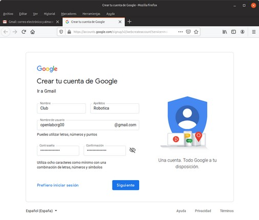
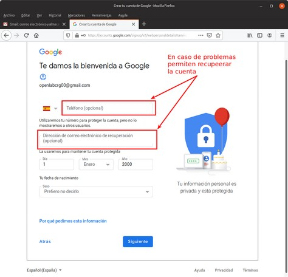
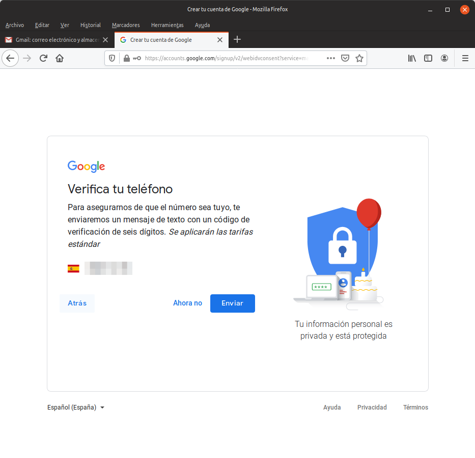
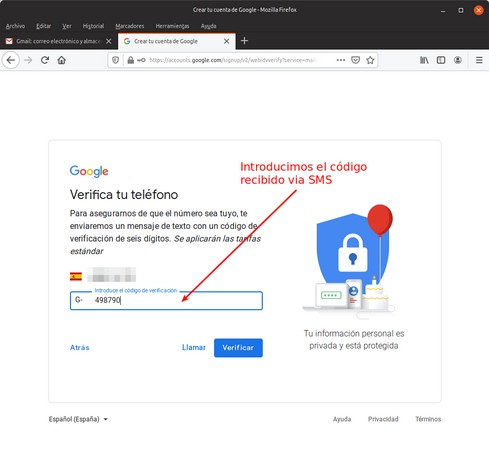
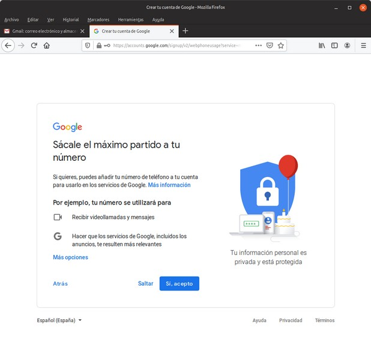
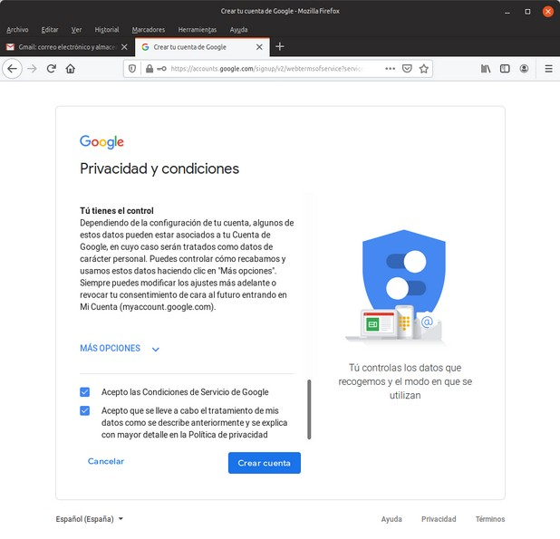
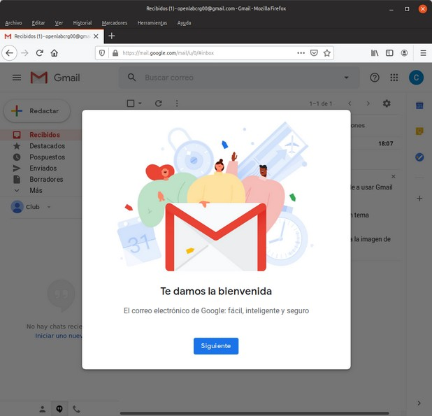
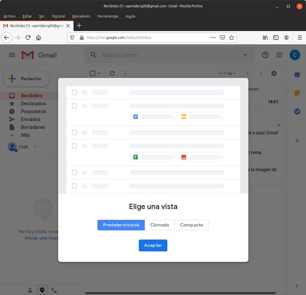
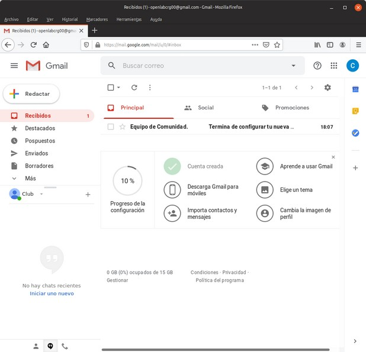

# Crear una cuenta en Gmail

Tenemos que usar una cuenta existente o seguir los pasos para crearnos una, por ejemplo en Gmail desde Mozilla Firefox. Si buscamos gmail debemos llegar a algo similar a lo que vemos en la imagen siguiente:

| Crear una cuenta en Gmail |
|:|
||

Cuando pulsamos en "Crear una cuenta" se nos muestra una pantalla en la que no pide los siguientes datos de la cuenta a crear:

* Nombre y apellidos 
* Nombre de la cuenta. Importante recordarlo
* Contraseña. Importante recordarlo

| Datos para crear una cuenta en Gmail |
|:|
||

Los datos opcionales son muy importantes si, por algún motivo, necesitamos recuperar la cuenta en un futuro. Datos de verificación de edad y sexo.

| Datos para verificar una cuenta en Gmail |
|:|
||

Verificación del teléfono suministrado.

| Verificación mediante número de teléfono |
|:|
||

Tecleamos el código recibido.

| Verificación mediante número de teléfono |
|:|
||

En la pantalla siguiente seleccionamos según nuestras preferencias.

| Selección según preferencias |
|:|
||

Leemos las condiciones que establece Google para poder crear una cuenta y marcamos para poder crear nuestra cuenta.

| Lectura y aceptación condiciones |
|:|
||

Se muestra una pantalla de bienvenida como la siguiente:

| Pantalla de bienvenida a Gmail |
|:|
||

Escogemos el tipo de visualización según preferencias.

| Tipo de visualización |
|:|
||

Llegamos por fin a la pantalla inicial de nuestra cuenta de Gmail que ya está operativa.

| En la cuenta de Gmail |
|:|
||

Dejamos abierta la cuenta y seguimos el proceso para crear cuenta en ArduinoBlocks.
