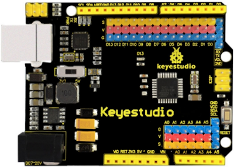
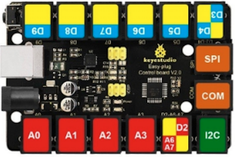

# Prueba de placas, shield y sensores para Arduino
Se realizará análisis y pruebas básicas de diferentes placas, sensores y escudos con exposición de resultados.
Las placas controladoras que más utilizaré son las de las imágenes, aunque también se verán y analizarán otras de esta marca, de otras marcas y originales.

| Con pines extendidos | Easy Plug |
|:|:|
| |

