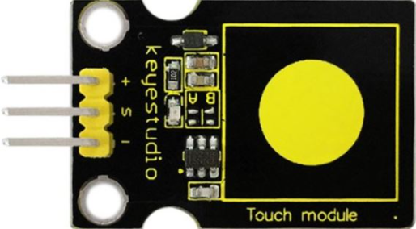
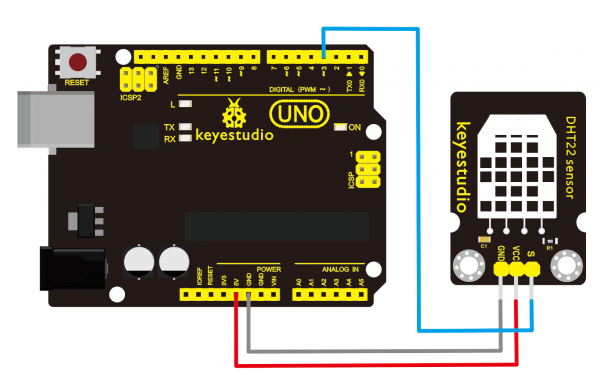

# Panel de sensores I2C, TdR STEAM y varias pantallas
Este panel está constituido por una placa tipo UNO, la shield IMAGINA TdR STEAM y los sensores y actuadores que iremos mencionando. En la imagen siguiente vemos el aspecto de ambas placas.

| Placa tipo UNO de keyestudio | Placa TdR STEAM |
|:|:|
|||

Toda la información que necesitemos de la placa TdR STEAM la vamos a encontrar en la página [Retos con TdR-STEAM y Keyestudio UNO](https://fgcoca.github.io/TdR-STEAM-and_UNO/).

## Panel de sensores I2C

### KS0392. Keyestudio Hub I2C
Para la expansión del conector I2C que integra la placa TdR STEAM utilizamos la shield de conversión I2C que vemos en la imagen siguiente.

| Hub I2C |
|:|
||

El conexionado entre la placa TdR STEAM y la shield tenemos que hacer con un un cable formado por cuatro conductores que en un extremo lleva un conector JST Macho de 4 pines (TdR) y en el otro un conector plano hembra también de 4 pines. El conector JST solamente puede colocarse en una posición y por lo tanto no hay posibilidad de error. Para colocar el conector plano nos fijamos en el nombre de uno de sus extremos en la shield y lo hacemos coincidir con el cable que corresponda en el conector JST, lo colocamos en su sitio y tenemos resuelta la conexión. Este mismo procedimiento lo llevaremos a cabo de forma similar con el resto de sensores y actuadores por lo que simplemente describimos los elementos usados en el panel.

### Ks0031. Sensor táctil capacitivo
Este sensor puede "sentir" el tacto de las personas incluso aislado por alguna tela y papel. Su sensibilidad disminuye a medida que la capa de aislamiento se hace más gruesa. Su aspecto y el diagrama típico de conexión lo vemos en la imagen siguiente.

| Sensor táctil capacitivo | Diagrama de conexión típico |
|:|:|
|||

El botón táctil va conectado al conector D5 de la placa TdR STEAM a través de un cable de 3 hilos apropiado. 

Indicar que este sensor no es I2C sino digital.

### KS0396. Matriz de LED 8x8 I2C direccionable
En la programación se va a establecer que el botón táctil sirva para cambiar de carita triste a carita sonriente la matriz de 8x8 LEDs al tiempo que emite un pitido el zumbador de la TdR STEAM.

Esta matriz utiliza el chip HT16K33 para controlar los 8x8 puntos o LEDs. Dispone de tres interruptores DIP con los que podemos configurar la dirección de comunicación I2C. Sus especificaciones técnicas son:

* Interfaz: 4Pin header
* Voltaje de funcionamiento: DC 4.5V-5.5V
* Dirección física: configurable

| Matriz de LED 8x8 I2C direccionable | Diagrama de conexión típico |
|:|:|
|||

En la tabla siguiente vemos como configurar los interruptores DIP para obtener las diferentes direcciones físicas disponibles.

| 3 | 2 | 1 | Dirección Hexadecimal |
|:|:|:|:|
| 0 | 0 | 0 | 0x70 |
| 0 | 0 | 1 | 0x71 |
| 0 | 1 | 0 | 0x72 |
| 0 | 1 | 1 | 0x73 |
| 1 | 0 | 0 | 0x74 |
| 1 | 0 | 1 | 0x75 |
| 1 | 1 | 0 | 0x76 |
| 1 | 1 | 1 | 0x77 |

### Ks0061. Pantalla LCD 1602 I2C
Pantalla LCD de 16 caracteres en 2 líneas con fondo azul y retroiluminación de luz blanca. La LCD original 1602 necesita 7 puertos IO para estar en funcionamiento, en cambio esta, al ser I2C, permite ahorrar 5 puertos. Especificaciones:

* I2C Dirección: 0x27. Modificable por hardware.
* Retroiluminado (Azul con color blanco).
* Tensión de alimentación: 5V.
* Interfaz: I2C.
* Contraste ajustable

| Pantalla LCD 1602 I2C | Diagrama de conexión típico |
|:|:|
|||

En el panel vamos a disponer de dos pantallas, para visualizar diferentes datos. En la primera de ellas cuando accionamos el pulsador SW1 en la TdR STEAM veremos la temperatura y humedad tanto del sensor DHT22 externo como del DHT11 de la placa. Si accionamos el pulsador SW2 veremos los datos de luminosidad capturados por la LDR de la placa y los del sensor de luz ambiental. La otra LCD se va a dedicar a mostrar los datos capturados por el sensor de eCO2 CCS811.

Para poder trabajar con dos pantallas de este tipo necesitamos cambiar la dirección física de una de ellas. En el enlace [cambiar la dirección física...](https://fgcoca.github.io/TdR-STEAM-and_UNO/R11/#cambiar-la-direccion-fisica-del-dispositivo-i2c) tenemos descrito este tema.

### Ks0098. Sensor de luz ambiente TEMT6000
Adaptado a la sensibilidad del ojo humano

| Sensor de luz ambiente | Diagrama de conexión típico |
|:|:|
|||

Este sensor no es I2C sino analógico.

### KS0430. Sensor de temperatura y humedad
Sensor que combina en una señal digital la medida de temperatura y humedad. Sus especificaciones técnicas son:

* Voltaje de funcionamiento: DC 3.3V-5V
* Señal de salida: digital de bus único
* Rango de medición de humedad: 0 a 100%
* Precisión de medición de humedad: ± 2%
* Rango de medición de temperatura: -40 °C a 80 °C
* Precisión de medición de temperatura: ± 0.5 °C

En la imagen siguiente vemos su aspecto y conexionado típico.

| Sensor de temperatura y humedad | Diagrama de conexión típico |
|:|:|
|||

Este sensor no es I2C sino digital.

### Ks0271. Pantalla OLED de 0.96"
Las siglas OLED (Organic Light Emitting Diode) pueden traducirse como Diodo Orgánico Emisor de Luz. A nivel microscópico, una pantalla OLED es una matriz de LED orgánicos que se encienden cuando emiten energía.

* Voltaje de funcionamiento: DC 3.3V-5V
* Número de píxeles: 128 × 64
* Profundidad de color: azul
* Forma de comunicación: I2C

En la imagen siguiente vemos su aspecto y conexionado típico.

| Pantalla OLED de 0.96" | Diagrama de conexión típico |
|:|:|
|||

Utilizaremos la pantalla OLED para mostrar los ángulos de rotación ortogonales en los ejes X e Y.

### Ks0012. Acelerómetro de tres ejes ADXL345"
El ADXL345 es un acelerómetro capacitivo (MEMS) de 3 ejes de baja potencia con medición de alta resolución (13 bits) de hasta +/-16g. Los datos de salida digital están formateados con 16 bits y se puede acceder a través de una interfaz digital SPI (3 o 4 hilos) o I2C.

El ADXL345 es adecuado para medir la aceleración estática de la gravedad en aplicaciones de detección de inclinación, así como la aceleración dinámica resultante del movimiento o el impacto. Su alta resolución (4mg/LSB) permite la medición de cambios de inclinación menores a 1.0 grado.

| Acelerómetro de tres ejes ADXL345 | Diagrama de conexión típico |
|:|:|
|||

En estos sensores miden la rotación del eje X (Roll), la rotación del eje Y (Pitch) y la rotación del eje Z (Yaw). Para saber mas sobre el tema se aconseja visitar la entrada [medir la inclinación con IMU](https://www.luisllamas.es/medir-la-inclinacion-imu-arduino-filtro-complementario/) disponible en el blog de Luis Llamas.

### KS0457. Sensor de eCO2 y TVOC CCS811
El sensor de gas CCS811B puede detectar una amplia gama de Compuestos Orgánicos Volátiles (VOCs) y está diseñado para el monitoreo de la calidad del aire. Cuando se conecta a la placa de control devolverá una lectura de Compuesto Orgánico Volátil Total (TVOC) y una lectura de Dióxido de Carbono Equivalente (eCO2). Sus especificaciones técnicas son:

* Voltaje de trabajo: DC 5V
* Corriente de trabajo: 30mA
* Potencia máxima: 46 mW
* Rango de medición de eCO2: 400-8192 ppm
* Rango de medición de TVOC: 0 a 1187 ppb
* Temperatura de trabajo: -25 a + 65 °C

Para aprender mas sobre este sensor no dejes de visitar el enlace [Semáforo óptico-acústico de CO2](https://clubroboticagranada.github.io/semaforo-optico-acustico-CO2/) especialmente en su entrada [Comparativa eCO2 versus CO2](https://clubroboticagranada.github.io/semaforo-optico-acustico-CO2/modular/comparativa/)

| Sensor de eCO2 y TVOC CCS811 | Diagrama de conexión típico |
|:|:|
|||

### KS0457. Sensor de color RGB TCS34725
El sensor puede reconocer el color de la superficie de un objeto a través de la detección óptica. El sensor se ilumina con luz brillante y emite los valores RGB correspondientes. Además, para evitar la interferencia del entorno y aumentar la precisión, dispone de una placa protectora de luz infrarroja en la parte inferior del sensor, de modo que el elemento de espectro infrarrojo de la luz incidente se minimiza para hacer que la gestión del color sea más precisa. En la parte inferior del sensor, se pueden ver 4 LEDs que garantizan que el sensor se pueda usar normalmente en condiciones de poca luz ambiental. Estas son sus especificaciones técnicas:

* Voltaje de funcionamiento: 3.3-5V
* Corriente de funcionamiento: 65uA
* Distancia medida: 3-10mm
* Frecuencia de reloj: 0-400KHZ
* Interfaz: I2C y paso de pin de 2,54 mm
* Rango de temperatura: -30 °C ~ + 70

En el panel se han dispuesto tres zonas de colores rojo, verde y azul que harán que cuando acerquemos el sensor a alguna de ellas el LED RGB en la TdR STEAM se ilumine en ese color permanecienco apagado si no detecta ninguno de los tres colores.

| Sensor de color RGB TCS34725 | Diagrama de conexión típico |
|:|:|
|||

## Programación del panel de sensores I2C
El proyecto está como público en el siguiente enlace: [acceder](https://fgcoca.github.io/Sensores-actuadores-y-shield-tipo-Arduino/).

También lo tenemos disponible para descargar e importar en este [enlace](firmware/panel-I2C.abp).

El siguiente código corresponde al programa elaborado en ArduinoBlocks.

***
~~~
#include <SPI.h>
#include <Wire.h>
#include <Adafruit_GFX.h>
#include <Adafruit_LEDBackpack.h>
#include <Adafruit_SSD1306.h>
#include "ABlocks_LiquidCrystal_I2C.h"
#include <ABLocks_TimerFreeTone.h>
#include "ADXL345.h"

#include "ABlocks_DHT.h"
#include "ABlocks_DHT.h"
#include <Adafruit_CCS811.h>
#include "Adafruit_TCS34725.h"

#include "ColorConverterLib.h"

double espera_con_bloqueo;
double X;
double Y;
double TDHT11;
double HDHT11;
double TDHT22;
double LDR;
double CO2;
double HDHT22;
double VOC;
double sen_luz_ambiente;
boolean b_boton_tactil;
boolean b_pulsador_2;
boolean b_pulsador_1;
Adafruit_8x8matrix ledmatrix_1 =Adafruit_8x8matrix();
Adafruit_SSD1306 oled_1(128,64, &Wire,-1);
LiquidCrystal_I2C lcd_1(0x27,16,2);
LiquidCrystal_I2C lcd_2(0x26,16,2);
static const uint8_t PROGMEM ledmatrix_data_sprite_face_happy[] PROGMEM = {B00000000,B01100110,B01100110,B00000000,B00000000,B11000011,B01100110,B00111100};
static const uint8_t PROGMEM ledmatrix_data_sprite_face_sad[] PROGMEM = {B00000000,B01100110,B00100100,B00000000,B00111100,B01100110,B11000011,B10000001};
byte lcd_1_customchar_0[8]={B00100,B01010,B01010,B00100,B00000,B00000,B00000,B00000};

unsigned long task_time_ms=0;

ADXL345 adxl345_accel;
DHT dht4(4,DHT11);
DHT dht3(3,DHT22);
Adafruit_CCS811 sensor_ccs811;
unsigned long sensor_ccs811_lastread=0;
double sensor_ccs811_co2_ppm=0.0;
double sensor_ccs811_co2_mgm3=0.0;
double sensor_ccs811_co2_tvoc_ppb=0.0;
Adafruit_TCS34725 tcs34725 = Adafruit_TCS34725(TCS34725_INTEGRATIONTIME_50MS, TCS34725_GAIN_1X);
double  tcs34725_r=0;
double  tcs34725_g=0;
double  tcs34725_b=0;
uint16_t  tcs34725_clear=0;
double  tcs34725_h=0;
double  tcs34725_s=0;
double  tcs34725_v=0;

void boton_tactil_matriz_8x8() {
	if (b_boton_tactil) {
		ledmatrix_1.setRotation(3);
		ledmatrix_1.clear();
		ledmatrix_1.drawBitmap(0,0,ledmatrix_data_sprite_face_happy,8,8,LED_ON);
		ledmatrix_1.writeDisplay();
		TimerFreeTone(8,523.26,200);
		delay(espera_con_bloqueo);
		TimerFreeTone(8,659.26,200);
		delay(espera_con_bloqueo);
	}
	else {
		ledmatrix_1.setRotation(3);
		ledmatrix_1.clear();
		ledmatrix_1.drawBitmap(0,0,ledmatrix_data_sprite_face_sad,8,8,LED_ON);
		ledmatrix_1.writeDisplay();
	}

}
void DHTs() {
	lcd_1.createChar(0, lcd_1_customchar_0);
	if (b_pulsador_1) {
		lcd_1.clear();
		lcd_1.setCursor(0, 0);
		lcd_1.print(String("11:T="));
		lcd_1.setCursor(5, 0);
		lcd_1.print((unsigned long)(TDHT11));
		lcd_1.setCursor(7, 0);
		lcd_1.write((byte)0);
		lcd_1.setCursor(8, 0);
		lcd_1.print(String("C"));
		lcd_1.setCursor(9, 0);
		lcd_1.print(String("-"));
		lcd_1.setCursor(10, 0);
		lcd_1.print(String("H="));
		lcd_1.setCursor(12, 0);
		lcd_1.print((unsigned long)(HDHT11));
		lcd_1.setCursor(14, 0);
		lcd_1.print(String("%"));
		lcd_1.setCursor(0, 1);
		lcd_1.print(String("22:T="));
		lcd_1.setCursor(5, 1);
		lcd_1.print((unsigned long)(TDHT22));
		lcd_1.setCursor(7, 1);
		lcd_1.write((byte)0);
		lcd_1.setCursor(8, 1);
		lcd_1.print(String("C"));
		lcd_1.setCursor(9, 1);
		lcd_1.print(String("-"));
		lcd_1.setCursor(10, 1);
		lcd_1.print(String("H="));
		lcd_1.setCursor(12, 1);
		lcd_1.print((unsigned long)(HDHT22));
		lcd_1.setCursor(14, 1);
		lcd_1.print(String("%"));
		delay(1000);
	}
	else {
		lcd_1.clear();
	}

}
void OLED_acelerometro() {
	if((millis()-task_time_ms)>=2000){
		task_time_ms=millis();
		oled_1.clearDisplay();
		oled_1.display();
		oled_1.setTextSize(3);
		oled_1.setTextColor(WHITE);
		oled_1.setCursor(0,10);
		oled_1.print(String("X: "));
		oled_1.display();
		oled_1.setTextSize(3);
		oled_1.setTextColor(WHITE);
		oled_1.setCursor(35,10);
		oled_1.print(X);
		oled_1.display();
		oled_1.setTextSize(3);
		oled_1.setTextColor(WHITE);
		oled_1.setCursor(0,40);
		oled_1.print(String("Y: "));
		oled_1.display();
		oled_1.setTextSize(3);
		oled_1.setTextColor(WHITE);
		oled_1.setCursor(35,40);
		oled_1.print(Y);
		oled_1.display();
	}
}
double fnc_adxl345(int _type)
{
	double v=0.0;
	if(_type>=1 && _type<=3){
		//raw data
		Vector data_raw = adxl345_accel.readRaw();
		if(_type==1)v=data_raw.XAxis;
		if(_type==2)v=data_raw.YAxis;
		if(_type==3)v=data_raw.ZAxis;
	}
	else{
		//noramlized data g=gravity
		Vector data_norm = adxl345_accel.readNormalize();
		if(_type>=4 && _type<=6){
			if(_type==4)v=data_norm.XAxis;
			if(_type==5)v=data_norm.YAxis;
			if(_type==6)v=data_norm.ZAxis;
		}
		else{
			//pitch,roll degrees
			Vector data_filtered = adxl345_accel.lowPassFilter(data_norm, 0.5);
			if(_type==7)v=(atan2(data_filtered.YAxis, data_filtered.ZAxis)*180.0)/M_PI;
			if(_type==8)v=-(atan2(data_filtered.XAxis, sqrt(data_filtered.YAxis*data_filtered.YAxis + data_filtered.ZAxis*data_filtered.ZAxis))*180.0)/M_PI;
		}
	}
	return v;
}

double fnc_ccs811_data(int _type)
{
	double v=0.0;
	if((millis()-sensor_ccs811_lastread)>=1000){
		if(sensor_ccs811.available() && (!sensor_ccs811.readData()) ){
			//update new values from sensor
			sensor_ccs811_co2_ppm=((double)sensor_ccs811.geteCO2());
			sensor_ccs811_co2_mgm3=((double)sensor_ccs811_co2_ppm*(double)1.8);
			sensor_ccs811_co2_tvoc_ppb=((double)sensor_ccs811.getTVOC());
			sensor_ccs811_lastread=millis();
		}
		else{
			//error reading sensor, reset values...
			sensor_ccs811_co2_ppm=0.0;
			sensor_ccs811_co2_mgm3=0.0;
			sensor_ccs811_co2_tvoc_ppb=0.0;
		}
	}
	//return value
	if(_type==0)v=sensor_ccs811_co2_ppm;
	if(_type==1)v=sensor_ccs811_co2_tvoc_ppb;
	if(_type==2)v=sensor_ccs811_co2_mgm3;

	return v;
}

void sensores() {
	b_boton_tactil = digitalRead(5);
	X = fnc_adxl345(7);
	Y = fnc_adxl345(8);
	TDHT11 = (unsigned long)(dht4.readTemperature());
	HDHT11 = (unsigned long)(dht4.readHumidity());
	TDHT22 = (unsigned long)(dht3.readTemperature());
	HDHT22 = (unsigned long)(dht3.readHumidity());
	b_pulsador_1 = digitalRead(2);
	b_pulsador_2 = digitalRead(7);
	sen_luz_ambiente = map(analogRead(A3),0,1023,0,100);
	LDR = map(analogRead(A1),0,1023,0,100);
	CO2 = fnc_ccs811_data(2);
	VOC = fnc_ccs811_data(1);
}
void fnc_tcs34725_capturecolor()
{
	uint16_t tcs_red, tcs_green, tcs_blue;
	tcs34725.getRawData(&tcs_red, &tcs_green, &tcs_blue, &tcs34725_clear);
	if (tcs34725_clear == 0) {
		tcs34725_r=tcs34725_g=tcs34725_b=0;
		return;
	}
	tcs34725_r = ((float)tcs_red / (float)tcs34725_clear * 255.0);
	tcs34725_g = ((float)tcs_green / (float)tcs34725_clear * 255.0);
	tcs34725_b = ((float)tcs_blue / (float)tcs34725_clear * 255.0);
	ColorConverter::RgbToHsv(static_cast<uint8_t>(tcs34725_r), static_cast<uint8_t>(tcs34725_g), static_cast<uint8_t>(tcs34725_b), tcs34725_h, tcs34725_s,tcs34725_v);
	tcs34725_h=tcs34725_h*360;
	tcs34725_s=tcs34725_s*100;
	tcs34725_v=tcs34725_v*100;
}

bool fnc_tcs34725_iscolor(int _color)
{
	if(tcs34725_h > 340 || tcs34725_h < 20){ if(_color==2) return true; } //red
	else if(tcs34725_h < 45){ if(_color==3) return true; }  //orange
	else if(tcs34725_h < 70){ if(_color==4) return true; }  //yellow
	else if(tcs34725_h < 150){ if(_color==5) return true; } //green
	else if(tcs34725_h < 210){ if(_color==6) return true; } //cyan
	else if(tcs34725_h < 265){ if(_color==7) return true; } //blue
 	else if(tcs34725_h < 340){ if(_color==8) return true; } //violet
	return false;
}

void sensor_color_RGB() {
	fnc_tcs34725_capturecolor();
	if (fnc_tcs34725_iscolor(2)) {
		analogWrite(6,255);
		analogWrite(9,0);
		analogWrite(10,0);
	}
	else if (fnc_tcs34725_iscolor(5)) {
		analogWrite(6,0);
		analogWrite(9,255);
		analogWrite(10,0);
	}
	else if (fnc_tcs34725_iscolor(7)) {
		analogWrite(6,0);
		analogWrite(9,0);
		analogWrite(10,255);
	}
	else {
		analogWrite(9,0);
		analogWrite(10,0);
		analogWrite(11,0);
	}

}
void luminosidad() {
	if (b_pulsador_2) {
		lcd_1.clear();
		lcd_1.setCursor(0, 0);
		lcd_1.print(String("Luz LDR: "));
		lcd_1.setCursor(9, 0);
		lcd_1.print((unsigned long)(LDR));
		lcd_1.setCursor(13, 0);
		lcd_1.print(String("%"));
		lcd_1.setCursor(0, 1);
		lcd_1.print(String("Luz TEMT: "));
		lcd_1.setCursor(10, 1);
		lcd_1.print((unsigned long)(sen_luz_ambiente));
		lcd_1.setCursor(13, 1);
		lcd_1.print(String("%"));
		delay(1000);
	}
	else {
		lcd_1.clear();
	}

}
void CO2_VOC() {
	lcd_2.clear();
	lcd_2.setCursor(0, 0);
	lcd_2.print(String("CO2:"));
	lcd_2.setCursor(0, 1);
	lcd_2.print(String("VOC:"));
	lcd_2.setCursor(5, 0);
	lcd_2.print((unsigned long)(CO2));
	lcd_2.setCursor(10, 0);
	lcd_2.print(String("mg/m3"));
	lcd_2.setCursor(5, 1);
	lcd_2.print((unsigned long)(VOC));
	lcd_2.setCursor(10, 1);
	lcd_2.print(String("ppb"));
	delay(1000);
}
void variables() {
	espera_con_bloqueo = 100;
	X = 0;
	Y = 0;
	TDHT11 = 0;
	HDHT11 = 0;
	TDHT22 = 0;
	HDHT22 = 0;
	sen_luz_ambiente = 0;
	LDR = 0;
	CO2 = 0;
	VOC = 0;
}

void setup()
{
  	pinMode(8, OUTPUT);
	pinMode(5, INPUT);
	pinMode(4, INPUT);
	pinMode(3, INPUT);
	pinMode(2, INPUT);
	pinMode(7, INPUT);
	pinMode(A3, INPUT);
	pinMode(A1, INPUT);
	pinMode(6, OUTPUT);
	pinMode(9, OUTPUT);
	pinMode(10, OUTPUT);
	pinMode(11, OUTPUT);
	adxl345_accel.begin(); adxl345_accel.setRange(ADXL345_RANGE_16G);
	dht4.begin();
	dht3.begin();
	sensor_ccs811.begin();

	tcs34725.begin();
	ledmatrix_1.begin(0x70);
	ledmatrix_1.setType(0);
	ledmatrix_1.setTextWrap(false);
	ledmatrix_1.setTextSize(1);
	ledmatrix_1.clear();
	ledmatrix_1.writeDisplay();
	oled_1.begin(SSD1306_SWITCHCAPVCC,0x3C);
	oled_1.clearDisplay();
	oled_1.display();
	oled_1.setTextSize(2);
	oled_1.setTextColor(WHITE);
	oled_1.setCursor(35,15);
	oled_1.print(String("OLED"));
	oled_1.display();
	oled_1.setTextSize(2);
	oled_1.setTextColor(WHITE);
	oled_1.setCursor(10,35);
	oled_1.print(String("iniciada"));
	oled_1.display();
	lcd_1.begin();
	lcd_1.noCursor();
	lcd_1.backlight();
	lcd_1.clear();
	lcd_1.setCursor(1, 0);
	lcd_1.print(String("LCD 1 iniciada"));
	lcd_2.begin();
	lcd_2.noCursor();
	lcd_2.backlight();
	lcd_2.clear();
	lcd_2.setCursor(1, 0);
	lcd_2.print(String("LCD 2 iniciada"));
	variables();

}

void loop()
{

  	sensores();
  	boton_tactil_matriz_8x8();
  	OLED_acelerometro();
  	sensor_color_RGB();
  	DHTs();
  	luminosidad();
  	CO2_VOC();

}
~~~
***
