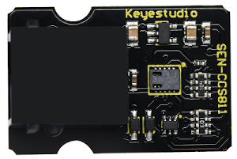

# Panel de sensores Easy Plug

## Panel de sensores y conexionado

### **Ks0240. Placa UNO Easy plug**

Disponemos de una placa de control Ks0240 como la de la imagen siguiente.

| Placa UNO Easy plug |
|:|
||

Las características de la placa Keyestudio Easy plug V2.0 son:

* 5 puertos digitales simples (D5 a D9)
* 3 puertos PWM (D5, D6 y D9)
* 1 puerto digital doble (D3-D4)
* 4 entradas analógicas (A0 a A3)
* 1 interface mixto digital/analógico (D2-A6-A7)
* 1 puerto de comunicación SPI
* 1 puerto de comunicación serie COM
* 1 interface de comunicación I2C
* 1 conector USB B
* 1 jack de alimentación (7 a 12V)
* 2 conectores ICSP

Todos los conectores RJ11 6P6C tienen Vcc y GND

Para la conexión entre placa de control y ordenador necesitamos un cable USB B a USB A como el de la imagen siguiente.

| Cable USB B-A |
|:|
||

### **KS0390. Placa de conversión e interface I2C**
Los conectores macho configuran 5 puertos de comunicación, lo que permite realizar comunicación I2C con 4 sensores con esta conexión al mismo tiempo. Los conectores Easy plug configuran 6 puertos de comunicación, lo que permite realizar comunicación I2C con 5 sensores con esta conexión al mismo tiempo. Se utiliza para ampliar el número de sensores I2C que se conectan a este puerto configurando diferentes direcciones. El aspecto del HUB I2C es el de la imagen siguiente:

| HUB I2C Easy Plug |
|:|
||

Conectamos mediante uno de los cables Easy Plug el HUB I2C a la placa de control, tal y como vemos en la imagen siguiente:

| Conexión HUB I2C Easy Plug |
|:|
||

### **KS0381. Pantalla LCD EASY plug I2C 1602**
La pantalla LCD es de 2 lineas y 16 caracteres por línea, configurada con la dirección I2C 0x27 y la utilizaremos para visualizar mensajes en ella. En la imagen siguiente vemos el aspecto de la pantalla y su conexionado.

| LCD 1602 | Conexión LCD |
|:|:|
||| 

### **Ks0112. Botón pulsador EASY plug**
Cuando se pulsa el botón, se emite una señal de nivel ALTO; si se suelta, emite una señal de nivel BAJO. Se utiliza para cambiar el nivel de estado de una entrada digital de BAJO a ALTO. Dispondremos dos botones para movernos hacía adelante o hacía atrás en la visualización de los datos suministrados por los sensores. El aspecto del botón y la conexión de los dos necesarios lo vemos en la imagen siguiente.

| Botón pulsador | Conexión botones |
|:|:|
||| 

### **Ks0224/Ks0225/Ks0226. Diodos LED EASY plug**
Para mostrar el estado de una determinada salida.
* Ks0224 - LED rojo
* Ks0225 - LED verde
* Ks0226 - LED amarillo

Se utiliza en nuestro proyecto para visualizar el estado de los pulsadores según el siguiente criterio:
* LED verde: Avance
* LED rojo: Atrás
* LED amarillo: ningún pulsador accionado

En la imagen siguiente tenemos el aspecto de los tres diodos y de su conexionado.

| Diodos LED | Conexión de los tres diodos LED |
|:|:|
||| 

### **KS0431. Sensor de Temperatura y Humedad EASY plug**
Sensor compuesto que contiene una señal de salida digital calibrada de temperatura y humedad relativa. El rango de medidas es:
* Humedad Relativa (HR): 0 a 100% 
* Precisión HR: ±2%
* Temperatura (T): de - 40℃ a 80℃
* Precisión T: ±0.5℃

Se utiliza para visualizar estos dos parámetros. En la imagen vemos su aspecto y conexionado.

| Sensor DHT22 | Conexión del DHT22 |
|:|:|
||| 

### **Ks0133. Sensor EASY plug de calidad del aire**
El sensor MQ135 utiliza como material sensible SnO2 por su baja conductividad eléctrica en aire limpio. Cuando está rodeado de aire contaminado, la conductividad eléctrica del sensor MQ135 aumentará, y este cambio se convierte en señal eléctrica de salida correspondiente. El potenciómetro permite ajustar la sensibilidad. Es sensible al amoníaco, sulfuro, vapor de benceno, humo y otros gases nocivos. Se utiliza para medir de forma analógica el valor entregado. Su aspecto y conexionado lo vemos en la imagen siguiente.

| Sensor MQ135 | Conexión del MQ135 |
|:|:|
||| 

### **Ks0106. LDR EASY plug**
Una fotorresistencia o resistencia dependiente de la luz (LDR) es una resistencia variable controlada por la luz. El principio es muy simple, la resistencia del fotorresistor varía con la intensidad de la luz incidente. Si la intensidad de la luz incidente es alta, la resistencia disminuye; Si la intensidad de la luz es baja, la resistencia aumenta. Se utiliza para comprobar las variaciones de luz en el entorno de la LDR sometiéndola a luz ambiente, tapándola y acercándola a una fuente de luz. En la imagen siguiente vemos su aspecto y el conexionado en este proyecto.

| LDR | Conexión LDR |
|:|:|
||| 

### **Ks0134. Sensor EASY plug de Presión Barométrica**
Sensor para medida de presión atmosférica y cálculo de altitud sobre el nivel del mar. Incorpora sensor de temperatura porque la necesita para las otras medidas.

* Rango de presión: 300 a 1100 hPa (Hecto Pascales)
* Rango de altitud: de 500 a 9000 metros.
* Interface I2C

Se utiliza para visualizar la altitud sobre el nivel del mar y la presión barométrica correspondiente a la posición actual del sensor. En la imagen siguiente vemos su aspecto y el conexionado.

| BMP180 | Conexión BMP180 |
|:|:|
||| 

### **KS2002. Sensor EASY plug CCS811 de eCO2 y TVOC**
El sensor CCS811B Easy Plug puede detectar una amplia gama de Compuestos Orgánicos Volátiles (VOCs) y está diseñado para el monitoreo de la calidad del aire. Cuando se conecta a la placa devolverá una lectura de TVOC y una lectura de Dióxido de Carbono Equivalente (eCO2).

Sus principales especificaciones son:

* Voltaje de funcionamiento: DC 5 V
* Corriente de trabajo: 30 mA
* Potencia máxima: 60 mW
* Rango de medición de eCO2: 400-29206 ppm
* Rango de medición TVOC: 0 a 32768 ppb
* Interfaz de comunicación: I2C

En la imagen siguiente vemos su aspecto y el conexionado.

| CCS811B | Conexión CCS811B |
|:|:|
||| 

### **Conexionado panel Easy Plug**
En la imagen siguiente tenemos todas las conexiones del proyecto.

| Conexiones panel de sensores Easy plug |
|:|
||

## Programación del panel de sensores Easy Plug
El proyecto está como público en el siguiente enlace: [acceder](http://www.arduinoblocks.com/web/project/699533)

También lo tenemos disponible para descargar e importar en este [enlace](firmware/Panel-STEAM-Easy%20Plug.abp).

El siguiente código corresponde al programa elaborado en ArduinoBlocks.

***
~~~
#include <Wire.h>
#include "ABlocks_LiquidCrystal_I2C.h"
#include "ABlocks_Button.h"
#include "ABlocks_DHT.h"
#include <Adafruit_BMP085.h>
#include <Adafruit_CCS811.h>

double Temperatura;
double Humedad;
double CalidadAire;
double luminosidad;
double opcion;
double Presion;
double Altitud;
double T_BMP;
double eCO2;
double TVOC;
boolean b_avance;
boolean b_atras;
LiquidCrystal_I2C lcd_1(0x27,16,2);
byte lcd_1_customchar_0[8]={B00010,B00101,B00010,B00000,B00000,B00000,B00000,B00000};

LiquidCrystal_I2C lcd(0x27,16,2);
Button button_debounced_5(5,50);

Button button_debounced_6(6,50);

DHT dht9(9,DHT22);
Adafruit_BMP085 bmp180;

Adafruit_CCS811 sensor_ccs811;
unsigned long sensor_ccs811_lastread=0;
double sensor_ccs811_co2_ppm=0.0;
double sensor_ccs811_co2_mgm3=0.0;
double sensor_ccs811_co2_tvoc_ppb=0.0;

void configurar() {
	lcd.backlight();
	lcd.clear();
	digitalWrite(A3, HIGH);
	digitalWrite(5, HIGH);
	digitalWrite(6, HIGH);
}
void bienvenida() {
	lcd.clear();
	lcd.setCursor(1, 0);
	lcd.print(String("Club Robotica"));
	lcd.setCursor(4, 1);
	lcd.print(String("Granada"));
	delay(3000);
	lcd.setCursor(1, 0);
	lcd.print(String("Panel Sensores"));
	lcd.setCursor(4, 1);
	lcd.print(String("Easy Plug"));
	delay(3000);
	lcd.clear();
	lcd.setCursor(0, 0);
	lcd.print(String("   Pulsadores"));
	lcd.setCursor(0, 1);
	lcd.print(String("Avance     Atras"));
}
void encenderLED() {
	digitalWrite(7, HIGH);
	digitalWrite(8, HIGH);
	digitalWrite(A3, HIGH);
}
void apagarR() {
	digitalWrite(7, LOW);
}
void encenderR() {
	digitalWrite(7, HIGH);
}
void encenderG() {
	digitalWrite(8, HIGH);
}
void apagarG() {
	digitalWrite(8, LOW);
}
void apagarLED() {
	digitalWrite(7, LOW);
	digitalWrite(8, LOW);
	digitalWrite(A3, LOW);
}
void encenderY() {
	digitalWrite(A3, HIGH);
}
void apagarY() {
	digitalWrite(A3, LOW);
}
void leerPulsador() {
	b_avance = button_debounced_5.pressed();
	b_atras = button_debounced_6.pressed();
	encenderY();
	if (b_avance) {
		apagarY();
		encenderG();
		if ((opcion < 7)) {
			opcion = (opcion + 1);
		}

	}

	if (b_atras) {
		apagarY();
		encenderR();
		if ((opcion > 1)) {
			opcion = (opcion - 1);
		}

	}

	delay(500);
	apagarG();
	apagarR();
}
double fnc_ccs811_data(int _type)
{
	double v=0.0;
	if((millis()-sensor_ccs811_lastread)>=1000){
		if(sensor_ccs811.available() && (!sensor_ccs811.readData()) ){
			//update new values from sensor
			sensor_ccs811_co2_ppm=((double)sensor_ccs811.geteCO2());
			sensor_ccs811_co2_mgm3=((double)sensor_ccs811_co2_ppm*(double)1.8);
			sensor_ccs811_co2_tvoc_ppb=((double)sensor_ccs811.getTVOC());
			sensor_ccs811_lastread=millis();
		}
		else{
			//error reading sensor, reset values...
			sensor_ccs811_co2_ppm=0.0;
			sensor_ccs811_co2_mgm3=0.0;
			sensor_ccs811_co2_tvoc_ppb=0.0;
		}
	}
	//return value
	if(_type==0)v=sensor_ccs811_co2_ppm;
	if(_type==1)v=sensor_ccs811_co2_tvoc_ppb;
	if(_type==2)v=sensor_ccs811_co2_mgm3;

	return v;
}

void leerSensores() {
	Temperatura = dht9.readTemperature();
	Humedad = dht9.readHumidity();
	CalidadAire = analogRead(A7);
	luminosidad = map(analogRead(A0),0,1023,0,100);
	Presion = (bmp180.readPressure()/100.0);
	Altitud = bmp180.readAltitude();
	T_BMP = bmp180.readTemperature();
	eCO2 = fnc_ccs811_data(2);
	TVOC = fnc_ccs811_data(1);
}

void setup()
{
  	pinMode(A3, OUTPUT);
	pinMode(5, OUTPUT);
	pinMode(6, OUTPUT);
	pinMode(7, OUTPUT);
	pinMode(8, OUTPUT);
	pinMode(5, INPUT);
	pinMode(6, INPUT);
	pinMode(9, INPUT);
	pinMode(A7, INPUT);
	pinMode(A0, INPUT);
lcd.begin();lcd.noCursor();lcd.backlight();
	dht9.begin();
	bmp180.begin();
	sensor_ccs811.begin();

	lcd_1.begin();
	lcd_1.noCursor();
	lcd_1.backlight();
	lcd_1.createChar(0, lcd_1_customchar_0);
	encenderLED();
	configurar();
	bienvenida();
	apagarLED();
	opcion = 0;

}

void loop()
{

  	leerPulsador();
  	leerSensores();
  	while ((opcion == 1)) {
  		lcd.clear();
  		lcd.setCursor(0, 0);
  		lcd.print(String("Temperatura: "));
  		lcd.setCursor(4, 1);
  		lcd.print(Temperatura);
  		lcd_1.setCursor(10, 1);
  		lcd_1.write((byte)0);
  		lcd.setCursor(11, 1);
  		lcd.print(String("C"));
  		leerPulsador();
  		leerSensores();
  		delay(10);
  	}
  	while ((opcion == 2)) {
  		lcd.clear();
  		lcd.setCursor(0, 0);
  		lcd.print(String("Humedad: "));
  		lcd.setCursor(6, 1);
  		lcd.print((long)(Humedad));
  		lcd.setCursor(9, 1);
  		lcd.print(String("%"));
  		leerPulsador();
  		leerSensores();
  	}
  	while ((opcion == 3)) {
  		lcd.clear();
  		lcd.setCursor(0, 0);
  		lcd.print(String("Calidad Aire:"));
  		lcd.setCursor(6, 1);
  		lcd.print((long)(CalidadAire));
  		leerPulsador();
  		leerSensores();
  	}
  	while ((opcion == 4)) {
  		lcd.clear();
  		lcd.setCursor(0, 0);
  		lcd.print(String("Luminosidad:"));
  		lcd.setCursor(5, 1);
  		lcd.print((long)(luminosidad));
  		lcd.setCursor(8, 1);
  		lcd.print(String("%"));
  		leerPulsador();
  		leerSensores();
  	}
  	while ((opcion == 5)) {
  		lcd.clear();
  		lcd.setCursor(0, 0);
  		lcd.print(String("Presion: "));
  		lcd.setCursor(4, 1);
  		lcd.print((long)(Presion));
  		lcd.setCursor(9, 1);
  		lcd.print(String("HPa"));
  		leerPulsador();
  		leerSensores();
  	}
  	while ((opcion == 6)) {
  		lcd.clear();
  		lcd.setCursor(0, 0);
  		lcd.print(String("Altitud: "));
  		lcd.setCursor(4, 1);
  		lcd.print((long)(Altitud));
  		lcd.setCursor(10, 1);
  		lcd.print(String("m"));
  		leerPulsador();
  		leerSensores();
  	}
  	while ((opcion == 7)) {
  		lcd.clear();
  		lcd.setCursor(0, 0);
  		lcd.print(String("eCO2: "));
  		lcd.setCursor(6, 0);
  		lcd.print((unsigned long)(eCO2));
  		lcd.setCursor(10, 0);
  		lcd.print(String("mg/m3"));
  		lcd.setCursor(0, 1);
  		lcd.print(String("TVOC: "));
  		lcd.setCursor(6, 1);
  		lcd.print((unsigned long)(TVOC));
  		lcd.setCursor(10, 1);
  		lcd.print(String("ppb"));
  		leerPulsador();
  		leerSensores();
  	}

}
~~~
***

