# La plataforma ArduinoBlocks

## **Descripción del entorno**
Para añadir bloques al programa arrastramos desde la barra de herramientas al área de programa, insertando dentro del bloque de inicialización o de bucle.

| Pantalla inicial de ArduinoBlocks |
|:|
|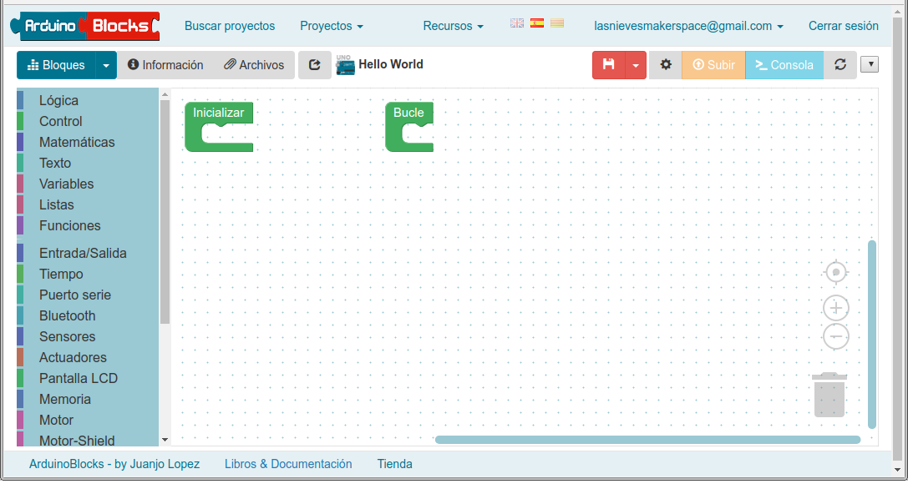|

* Si no son funciones, todos los bloques fuera de los dos por defecto son ignorados.
* ArduinoBlocks genera el código de Arduino a partir de los bloques.
* El programa se puede compilar y subir directamente a la placa Arduino gracias a la aplicación ArduinoBlocks-Connector

| Descripciones de la pantalla inicial de ArduinoBlocks |
|:|
|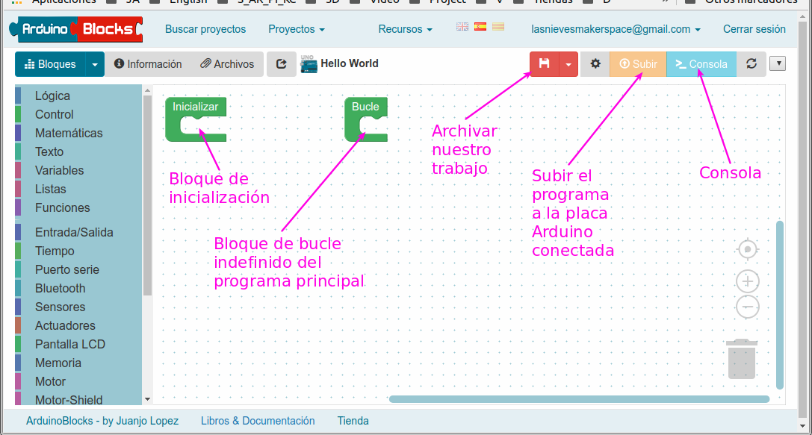|

ArduinoBlocks genera el código de Arduino a partir de los bloques. Si deseamos ver o descargar el código podemos realizarlo desde el área de bloques.

| Ver el código generado por ArduinoBlocks |
|:|
|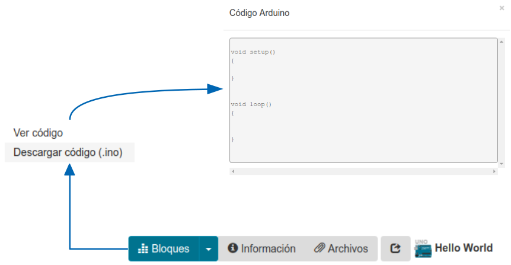|

Si hacemos clic en el botón "Información" accedemos a toda la información del proyecto para cumplimentar o editar y también nos permite hacer nuestro proyecto público.

| Información del proyecto |
|:|
|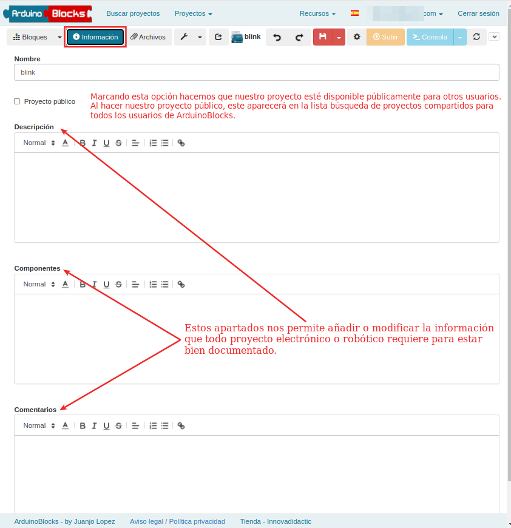|

Si hacemos clic en el botón archivos accedemos a las opciones que se describen en la imagen siguiente:

| Archivos del proyecto |
|:|
|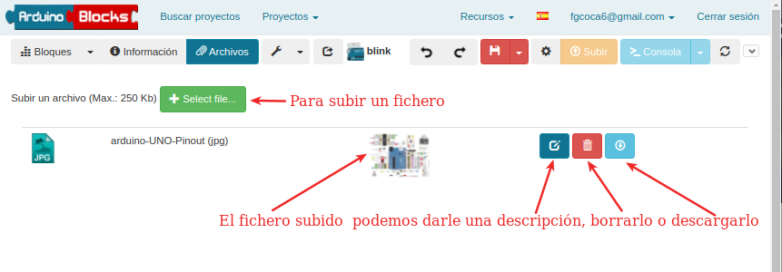|

Es muy interesante subir esquemas de montaje del proyecto realizados por ejemplo con Fritzing.

Si hacemos clic en el desplegable de la llave fija se muestra un menú que nos permite crear símbolos de una forma sencilla para diferentes dispositivos de visualización y también un enlace a información sobre RTTTL.

| Botón herramientas |
|:|
|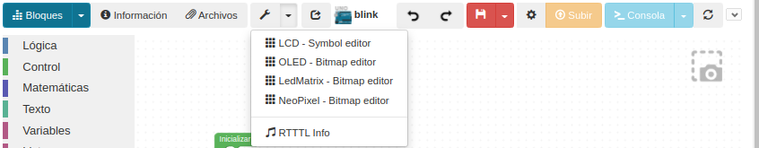|

En la imagen siguiente se realiza la descripción del resto de botones e información disponible en esta barra.

| Resto de la barra de botones |
|:|
|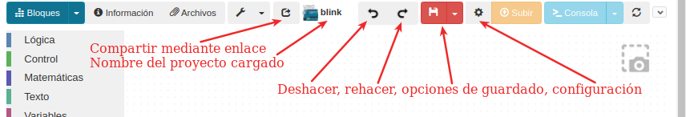|

La imagen a la izquierda del nombre del proyecto es un enlace a una página de ArduinoBlocks con información de la placa usada.

Aunque ArduinoBlocks guarda de forma automática cada cierto tiempo, podemos hacerlo de forma manual pulsando sobre el disquete o sobre el desplegable. La principal utilidad es la de crear un nuevo proyecto a partir del actual pulsando la opción “Guardar como”, lo que abrirá el nuevo proyecto creado a partir del primero. También permite generar el proyecto para alumnos, cambiar de tipo de proyecto, o sea cambiar la placa usada dentro de las opciones disponibles y exportar el archivo a nuestro ordenador. La ventana para cambiar el tipo de proyecto se muestra en la imagen siguiente:

| Opciones para cambiar el tipo de proyecto |
|:|
|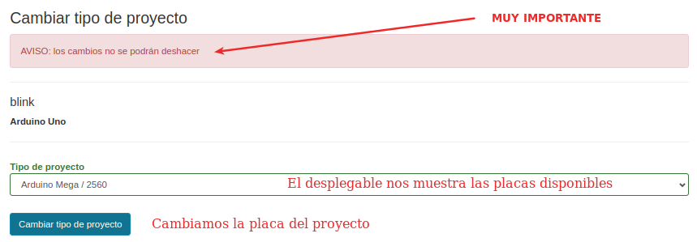|

Si accedemos a Buscar proyectos podremos visualizar los compartidos por otros usuarios, completar las opciones de búsqueda que nos interesen, ver información del proyecto cómo los “Me gusta o Like”, ver el número de visualizaciones que tiene y visualizarlo nosotros mismos.

| Opciones de "Buscaar proyectos" |
|:|
|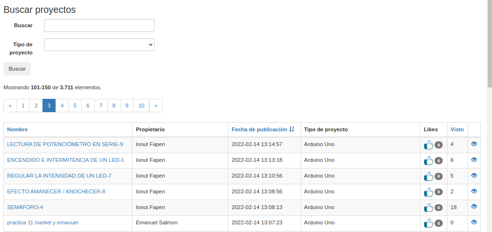|

Al acceder a visualizar un proyecto compartido por otro usuario nos aparecerá un botón “importar a mis proyectos”, que nos permite crear una copia del proyecto en mis proyectos personales para poder modificarlo a nuestro gusto. Tenemos un botón “Me gusta” que nos permite valorar positivamente el trabajo realizado por el usuario.

| Visualizar un proyecto compartido |
|:|
|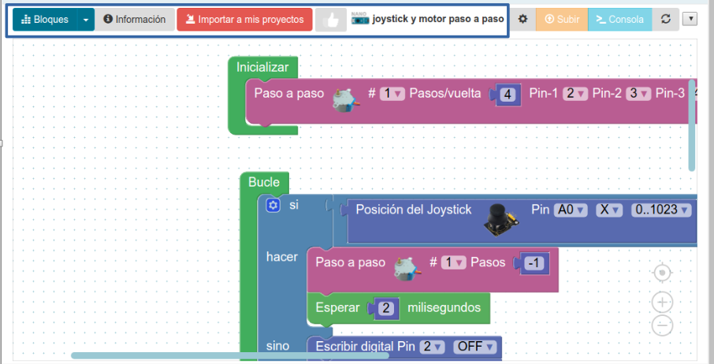|

## **Estructura de un proyecto**
Un proyecto Arduino tiene siempre dos estructuras importantes en su interior. Vamos a crear un ejemplo sencillo al que llamaremos Blink escogiendo tipo Arduino UNO.

| Estructura básica de un proyecto |
|:|
|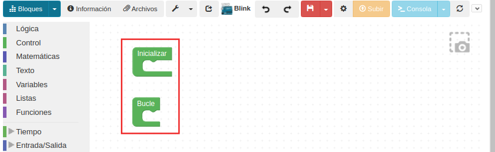|

### Blink

Vamos a hacer que al iniciar (o hacer reset) se envíe el mensaje por el puerto serie “Inicialización del proyecto Blink”. Para ello procedemos como se ve en la imagen siguiente.

| Configuración de Inicializar para el proyecto Blink |
|:|
|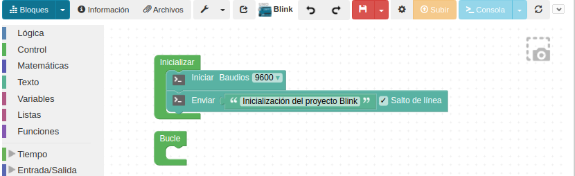|

### ArduinoBlocks connector
Es una aplicación puente entre la plataforma on-line ArduinoBlocks y el hardware Arduino. La aplicación recibe el código generado por ArduinoBlocks, lo compila y lo sube a la placa Arduino.

Está disponible para los principales sistemas operativos. En el área de descargas de Arduinoblocks.com se puede obtener la última versión y más información sobre el proceso de instalación y configuración. [Connector](http://www.arduinoblocks.com/web/site/abconnector).

| Aspecto de la página de descarga de Connector |
|:|
|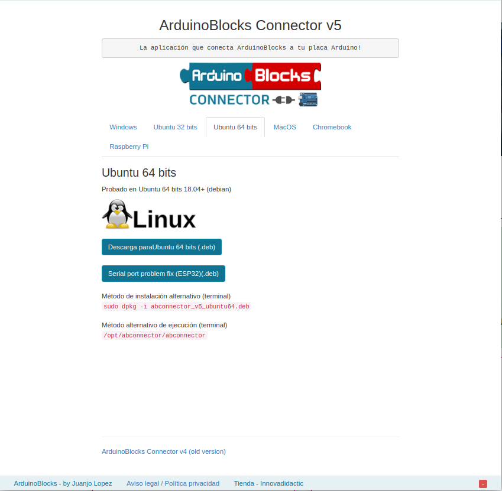|

Para poder grabar nuestro proyecto en la placa Arduino necesitamos tener activado Connector. En la imagen siguiente vemos el icono y el programa en ejecución.

| ArduinoBlocks Connector |
|:|
|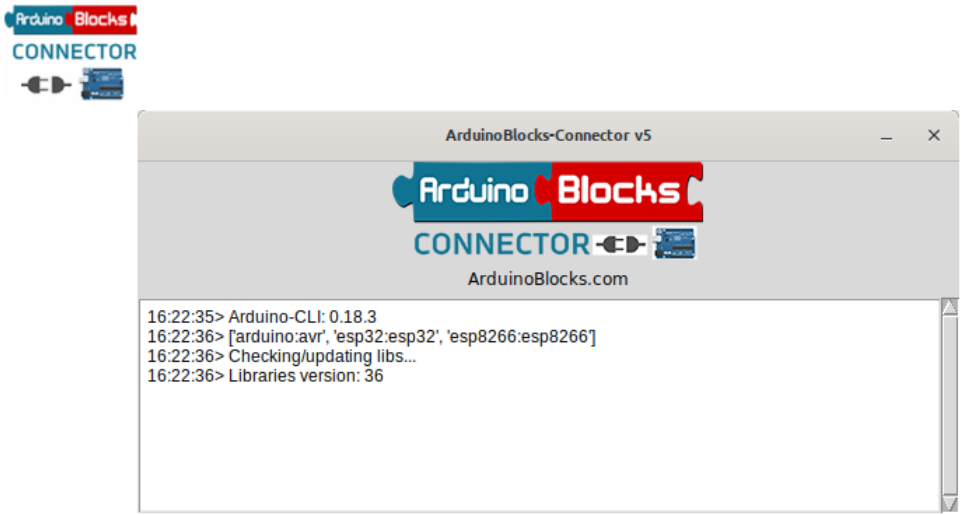|

Ya podemos grabar el firmware directamente en nuestra placa a través de Connector. Para ello conectamos la placa a un puerto USB y hacemos clic en Subir y al cabo de unos instantes veremos algo similar a lo de la imagen siguiente:

| Blink subido correctamente |
|:|
|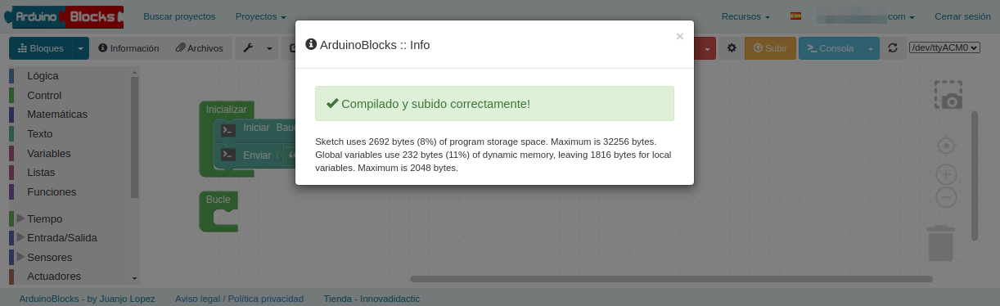|

Ya hemos probado la comunicación entre la plataforma y nuestro equipo y podemos continuar con el proyecto Blink.

### Continuación de Blink
Consultando el pinout de la placa Arduino UNO vemos que en el pin 13 está conectado el LED L, como vemos en la imagen siguiente. Vamos a hacerlo parpadear.

| LED onboard conectado a D13 |
|:|
|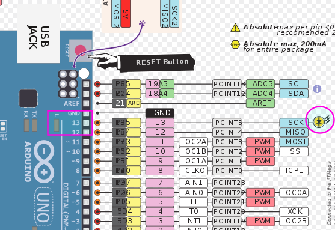|

Colocamos el bloque de escritura de pin en Bucle y lo configuramos para el pin 13. Situamos un bloque de retardo que configuramos a 500 milisegundos. Montamos el programa que vemos en la imagen siguiente:

| Programa Blink |
|:|
|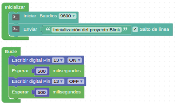|

 Ya podemos subir el programa a nuestra placa y comprobar el funcionamiento. En la imagen siguiente vemos el resultado en la consola.

| Consola en el programa Blink |
|:|
|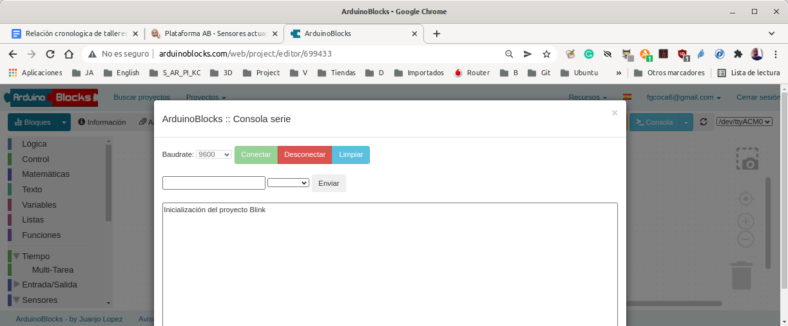|

### Análisis del código
Veamos el código por bloques y linea a línea. En la imagen siguiente tenemos relacionados los dos bloques principales con sus líneas de código correspondientes.

| Código del programa Blink |
|:|
|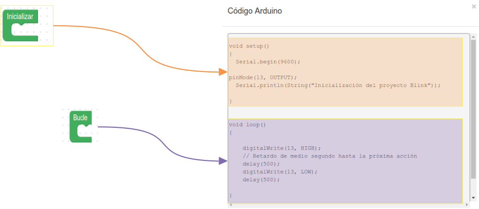|

A continuación vemos el código del bloque Inicializar.

***
~~~
void setup()
{
  	pinMode(13, OUTPUT);
	Serial.begin(9600);
	Serial.flush();
	while(Serial.available()>0)Serial.read();

	Serial.println(String("Inicialización del proyecto Blink"));

}
~~~
***

* Establecemos el pin 13 como salida: pinMode(13, OUTPUT);
* Inicializamos la consola con una velocidad de transmisión de 9600 baudios: Serial.begin(9600);
* Espera a que la transmisión de datos de salida serie termine: Serial.flush();
* Consulta si el número de bytes (caracteres) disponibles para lectura desde el puerto serie es mayor que cero: while(Serial.available()>0)Serial.read();
* Mandamos el mensaje entrecomillado a la consola: Serial.println(String("Inicialización del proyecto Blink"));

El código del bloque Bucle es el siguiente:

***
~~~
void loop()
{
  	digitalWrite(13, HIGH);
  	delay(500);
  	digitalWrite(13, LOW);
  	delay(500);

}
~~~
***

* Establecemos un nivel alto en el pin 13 mediante escritura digital: digitalWrite(13, HIGH);
* Retardo de medio segundo: delay(500);
* Establecemos un nivel bajo en el pin 13 mediante escritura digital: digitalWrite(13, LOW);
* Retardo de medio segundo: delay(500);
