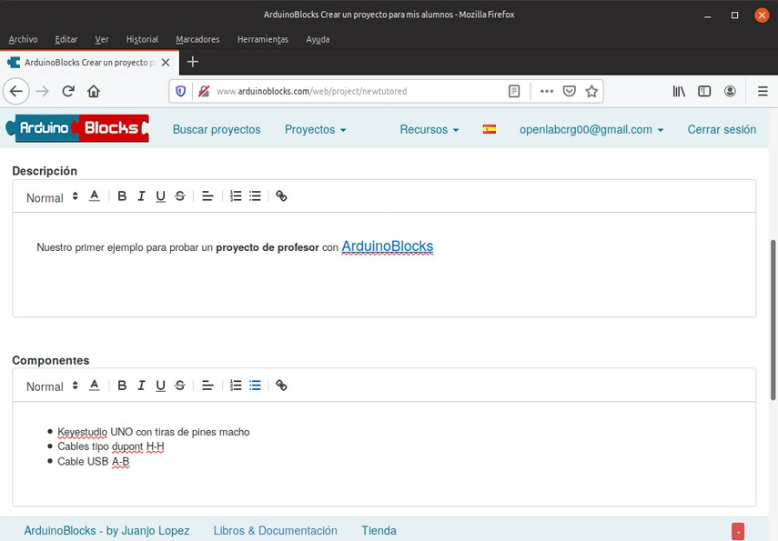
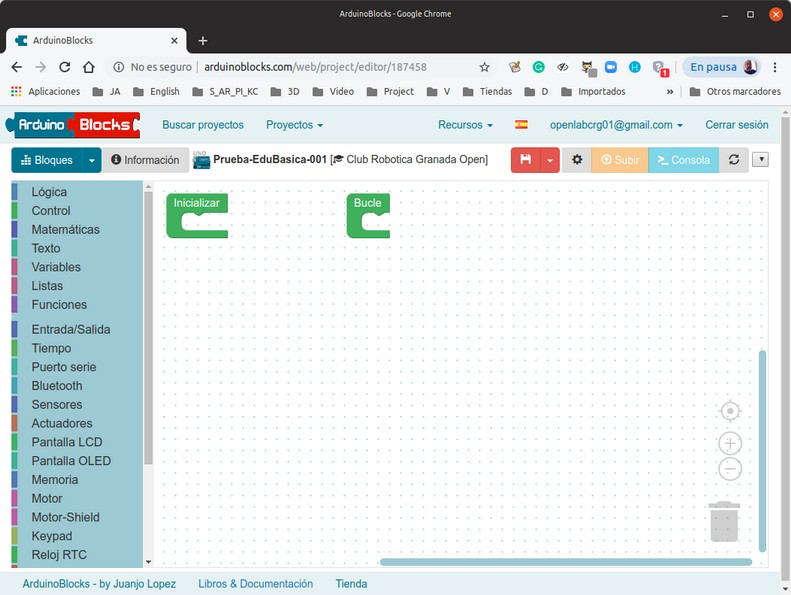

# Primeros pasos con ArduinoBlocks
La pantalla inicial de ArduinoBlocks presenta el siguiente aspecto:

| Pantalla inicial de ArduinoBlocks |
|:|
||

## **Configuraciones**
Clic sobre la bandera para escoger entre los idiomas disponibles.

| idioma |
|:|
||

En las opciones de edición del perfil que incluye la eliminación de la cuenta, el cambio de contraseña y los usuarios gestionados, que básicamente permite crear cuentas para alumnos o centro educativo sin necesidad de correo electrónico de los alumnos y los usuarios estarán bajo el control de la cuenta de usuario del profesor (o profesores). Los usuarios gestionados tienen algunas limitaciones como no permitir archivos adjuntos en los proyectos o no poder crear proyectos como profesor.

| Opciones de configuración |
|:|
||

## **Recursos**
En el menú desplegable tenemos los recursos disponibles:
* ArduinoBlocks Connector
* Libros y Documentación
* Librerías Arduino

| Recursos |
|:|
||

### ArduinoBlocks Connector
Esta aplicación es necesaria para poder subir nuestros programas a la placa Arduino.

| Connector |
|:|
||

### Librerías Arduino
Nos permite descargar las librerías que utiliza la plataforma por si necesitamos usarlas fuera de esta.

| Librerías |
|:|
||

### Libros y Documentación
Se trata de un enlace que nos muestra todos los recursos disponibles.

| Libros y documentación |
|:|
||

### Resto de opciones
Se trata de un enlace que nos muestra todos los recursos disponibles.

| Resto de opciones |
|:|
||

## **Crear proyectos**
Para iniciar un nuevo proyecto debemos hacer clic en el menú Proyectos -->  Nuevo proyecto o en el botón indicado.

| Empezar nuevo proyecto |
|:|
||

### Tipo de proyecto: Personal
Iniciar un nuevo proyecto que sólo será accesible para el usuario. Posteriormente se puede compartir al resto de la comunidad si se desea.

| Empezar proyecto personal |
|:|
||

### Tipo de proyecto: Profesor
No se inicia un proyecto como tal, sino que se especifican los datos del proyecto y se genera un código para que los alumnos se puedan suscribir al proyecto. El profesor podrá supervisar y valorar los proyectos de sus alumnos.

| Empezar proyecto profesor |
|:|
||

### Tipo de proyecto: Alumno
Permite que nos unamos a un proyecto planteado por el profesor. Nosotros realizaremos el proyecto como si de un proyecto personal se tratara, pero el profesor podrá supervisar y valorar nuestro trabajo.

| Empezar proyecto Alumno |
|:|
||

### Ejemplo: Crear proyecto como Profesor
Escogemos opciones.

| Ejemplo proyecto |
|:|
||

En la imagen siguiente vemos una serie de apartados que aunque son opcionales es conveniente cumplimentarlos.

| Ejemplo proyecto |
|:|
||

Comentarios adicionales y código del proyecto:

| Ejemplo proyecto |
|:|
||

Tenemos creado nuestro primer proyecto.

| Ejemplo proyecto |
|:|
||

Si creamos un proyecto como Alumno podemos adherirnos al de profesor.

| Ejemplo proyecto |
|:|
||

Y accedemos al entorno de programación de la plataforma.

| Ejemplo proyecto |
|:|
||

Con la opción ver alumnos adheridos accedemos a una ventana como la de la imagen donde podemos ver los proyectos individuales.

| Ejemplo proyecto |
|:|
||

