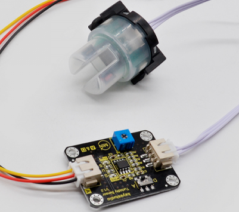
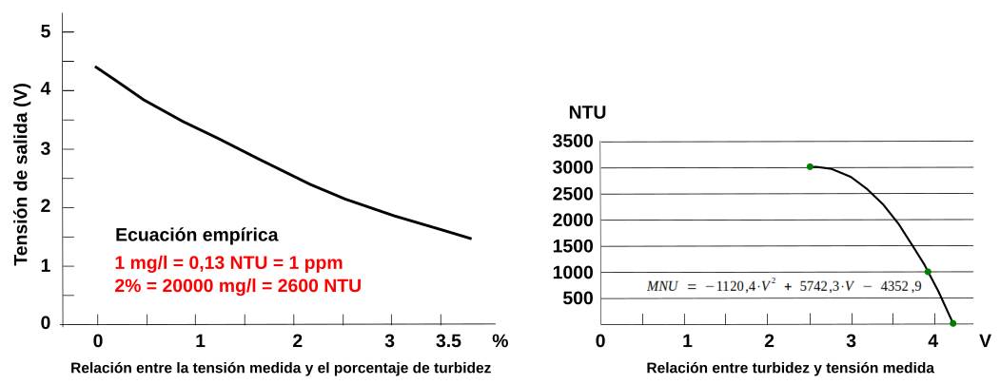
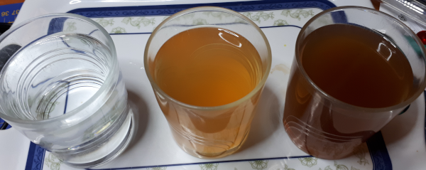
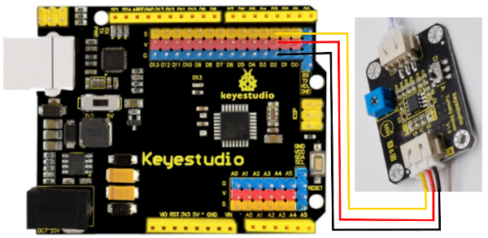
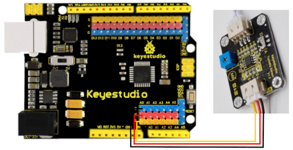
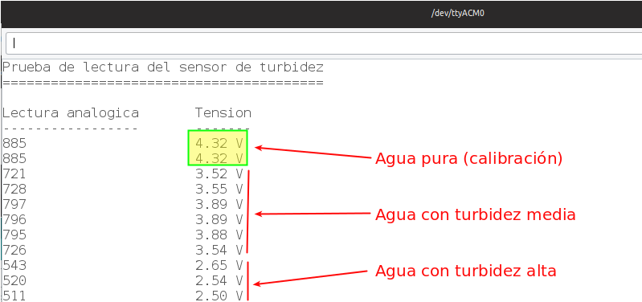
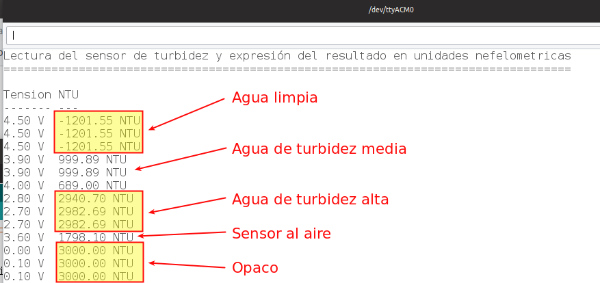

# Sensor de turbidez

## Descripción
Se trata del [KS0414 Keyestudio Turbidity Sensor V1.0](https://wiki.keyestudio.com/KS0414_Keyestudio_Turbidity_Sensor_V1.0) del que disponemos en su wiki de toda la información. El funcionamiento del sensor de turbidez está basado en el efecto Tyndall, el cual describe que la dispersión de la luz proyectada en un líquido con partículas suspendidas será mayor cuanto mayor sea el número de partículas.

El módulo consta de una placa amplificadora y un sensor, tal y como vemos en la imagen siguiente:

| Elementos del sensor de turbidez |
|:|
||

Tiene un rango de detección de entre 0% y 3.5% (0 y 4550 NTU), con un margen de error de ±0.5%. La turbidez se mide en Unidades Nefelométricas de turbidez, o Nephelometric Turbidity Unit (NTU) y el instrumento usado para su medida es el nefelómetro o turbidímetro.

El sensor dispone de dos modos de operación o dos tipos de señal de salida, analógica y digital. En el modo analógico el cálculo de la turbidez del agua se realiza a partir del nivel de tensión medido por el sensor. El modo de operación se selecciona mediante un interruptor deslizante, siendo la posición A la correspondiente al analógico y D el digital. Lógicamente la posición del interruptor determina la patilla a la que debemos conectarlo. La resistencia ajustable de color azul permite ajustar la sensibilidad del sensor.

**Debemos tener muy presente que la parte superior de la sonda no es sumergible.**

## Especificaciones

* Tensión de alimentación: 5V DC
* Consumo: 11mA aproximadamente
* Rango de detección: 0% a -3.5%（0-4550 NTU）
* Temperatura de trabajo: -30 ℃~ 80 ℃
* Temperatura de almacenamiento：-10 ℃ ~ 80 ℃
* Margen de error: ±0.5%
* Peso: 18g

## Curvas características
En la imagen vemos dos gráficas que establecen la relación entre la turbidez y la tensión medida por el sensor. La de la derecha es más precisa y además nos da directamente la medida en NTU por lo que será la que usemos en nuestros ejemplos.

| Relaciones tensión medida - turbidez |
|:|
||

## Ejemplos de uso del sensor
Vamos a ver la aplicación analógica y digital del sensor y haremos las pruebas sobre un set preparado con tres grados de turbidez a partir de agua del grifo, turbidez media y alta creadas a partir de la disolución de café en agua. En la figura siguiente vemos el aspecto.

| Tres grados de turbidez |
|:|
||

### Lectura digital. Calibración

* **POSICIÓN DEL INTERRUPTOR: D**

Vamos a realizar la prueba mas sencilla del sensor que nos servirá para su calibración. Se trata de realizar el siguiente programa:

***  
~~~  
/* ----------------------------------------------------------------------------------------------------------  
// Programa...: Lectura-digital.ino   
// Autor......: @fgcoca (octubre-2019)  
// Descripción: Visualización en el LED onboard (pin 13) del ajuste del potenciometro cómo valor digital.  
// ---------------------------------------------------------------------------------------------------------- */  
#define Turbidy_sensor 2 //Conectamos el sensor al pin digital 2  
//Poner el interruptor el posición D  
const int ledPin = 13; //Led onboard  

void setup() {  
  pinMode(ledPin, OUTPUT); //Configuramos pin 13 como salida  
  pinMode(Turbidy_sensor, INPUT); //Configuramos el pin del sensor de turbidez como entrada  
}  
void loop() {  
  if(digitalRead(Turbidy_sensor)==LOW){  //Lectura de la señal del sensor  
    digitalWrite(ledPin, HIGH);  //Si el sensor indica nivel bajo (LOW) encendemos el LED  
  }  
  else{  
    digitalWrite(ledPin, LOW);    //Si el sensor indica nivel alto (HIGH) encendemos el LED  
  }  
}  
~~~  
***

El montaje lo vemos en la imagen siguiente:

| Montaje para lectura digital |
|:|
||

Introducimos el sensor en agua limpia (si es agua destilada será más fiable la calibración) y vamos retocando la posición del potenciometro hasta que el diodo LED asociado al pin 13 se encienda o se apague dependiendo de la posición en la que estuviese. Justo en el momento del cambio debemos girarlo muy suavemente hasta que el LED permanezca apagado. Probamos a introducir el sensor en las muestras turbias para comprobar que el el LED se enciende. Esta será la posición de calibrado que comprobaremos en el siguiente ejemplo.

Puedes descargar el archivo [Lectura-digital.ino](Programas/Sensor-turbidez/Lectura-digital/Lectura-digital.ino) si te resulta más cómodo.

### Lectura básica analógica

* **POSICIÓN DEL INTERRUPTOR: A**

El siguiente código escrito en el IDE de Arduino nos permite obtener lecturas básicas del sensor y enviarlas al monitor serie.

***  
~~~  
/* ----------------------------------------------------------------------------------------------------------   
// Programa...: Lectura-basica.ino   
// Autor......: @fgcoca (octubre-2019)  
// Descripción: Visualización del valor de tensión del sensor de turbidez en el terminal serie.  
// ---------------------------------------------------------------------------------------------------------- */  
#define Turbidy_sensor A0   
int TurbidySensorValue = 0;  
float Tension = 0.0;  
void setup() {  
  Serial.begin(9600); // Velocidad de comunicación  
  Serial.println("Prueba de lectura del sensor de turbidez");  
  Serial.println("========================================");  
  Serial.println(" ");  
  Serial.println("Lectura analogica\tTension");   
  Serial.println("-----------------\t-------");  
}  
void loop() {  
  TurbidySensorValue = analogRead(Turbidy_sensor); // Lectura del pin analógico 0  
  Tension = TurbidySensorValue * (5.0 / 1024.0); // Mapeo de la lectura analógica  
  //Envio de valores y textos al terminal serie  
  Serial.print(TurbidySensorValue);   
  Serial.print("\t\t\t");  
  Serial.print(Tension);  
  Serial.println(" V");  
  delay(3000);  
}  
~~~

***

Puedes descargar el archivo [Lectura-basica.ino](Programas/Sensor-turbidez/Lectura-basica/Lectura-basica.ino) si te resulta más cómodo.

El montaje es el de la imagen siguiente:

| Montaje para lectura analógica |
|:|
||

Los resultados los vemos en la gráfica siguiente:

| Resultados para el montaje para lectura analógica |
|:|
||

Observamos como la tensión está en un valor de 4.1 ± 0.3V para el ajuste del potenciometro realizado en el ejercicio anterior. Si hemos realizado el ajuste con agua pura y una temperatura comprendida entre 15 y 40 ºC tenemos un valor de NTU < 0.5, lo que indica que el ajuste, y por tanto la calibración son correctos.

### Lectura en Unidades Nefelométricas de turbidez (NTU)

* **POSICIÓN DEL INTERRUPTOR: A**

Finalmente vamos a realizar un ejercicio de medida de la turbidez del agua expresando el resultado en unidades nefelométricas.
El código del programa es el siguiente:

***

~~~
/* ----------------------------------------------------------------------------------------------------------  
// Programa...: Lectura-NTU.ino   
// Autor......: @fgcoca (octubre-2019)  
// Descripción: Visualización del valor de tensión y de turbidez en NTU en el terminal serie.  
// ---------------------------------------------------------------------------------------------------------- */  
#define Turbidy_sensor A0   
float Tension = 0.0;  
float NTU = 0.0;  
void setup() {   
  Serial.begin(9600); // Velocidad de comunicación  
  Serial.println("Lectura del sensor de turbidez y expresión del resultado en unidades nefelometricas");  
  Serial.println("===================================================================================");  
  Serial.println(" ");  
  Serial.println("Tension\tNTU");   
  Serial.println("-------\t---");  
}  
void loop() {  
  Tension = 0;  
  Tension = analogRead(Turbidy_sensor)/1024*5; // Mapeo de la lectura analógica  
  //Para compensar el ruido producido en el sensor tomamos 500 muestras y obtenemos la media  
  for(int i=0; i<500; i++)  
    {  
      Tension += ((float)analogRead(Turbidy_sensor)/1024)*5;  
    }  
    Tension = Tension/500;  
    Tension = redondeo(Tension,1);  
    //Para ajustarnos a la gráfica de la derecha  
    if(Tension < 2.5){  
      NTU = 3000;  
    }else{  
      NTU = -1120.4*square(Tension)+5742.3*Tension-4352.9;   
    }  
  //Envio de valores y textos al terminal serie  
  Serial.print(Tension);  
  Serial.print(" V");  
  Serial.print("\t");  
  Serial.print(NTU);  
  Serial.println(" NTU");  
  delay(5000);  
}  

float redondeo(float p_entera, int p_decimal)  
{  
  float multiplicador = powf( 10.0f, p_decimal);  //redondeo a 2 decimales  
  p_entera = roundf(p_entera * multiplicador) / multiplicador;  
  return p_entera;  
}  
~~~

***

Puedes descargar el archivo [Lectura-NTU.ino](Programas/Sensor-turbidez/Lectura-NTU/Lectura-NTU.ino) si te resulta más cómodo.

El montaje es el mismo que en el ejercicio anterior.

Los resultados de las pruebas sobre el set de medida las vemos en la gráfica siguiente:

| Resultados para el montaje para lectura en NTU |
|:|
||

